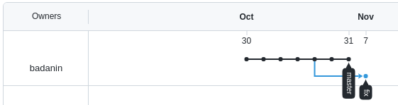
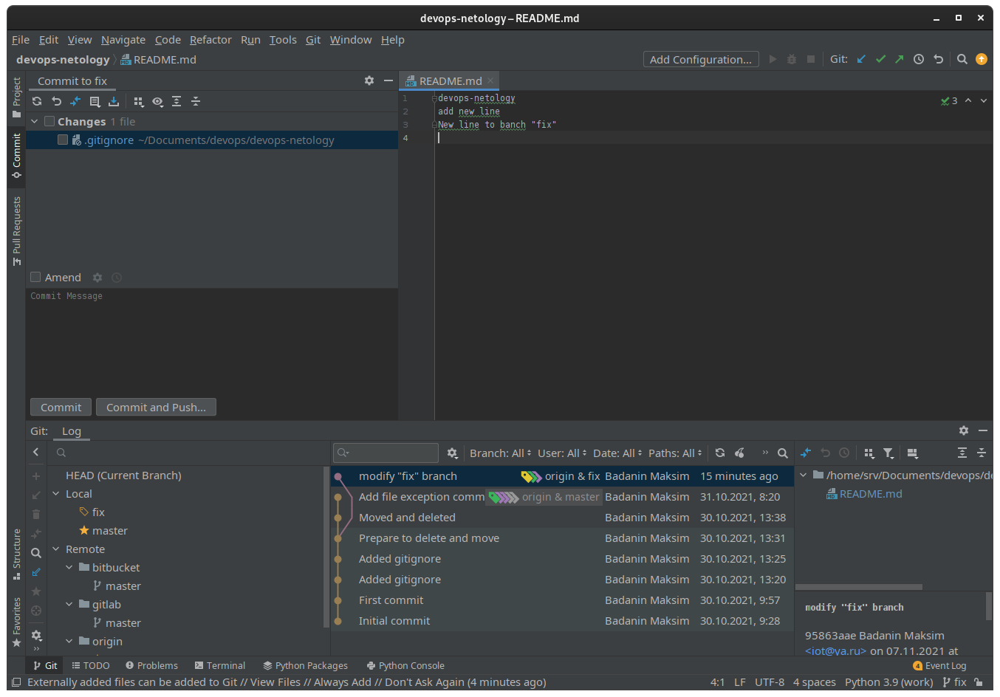

# Домашнее задание к занятию «2.2. Основы Git»
## Задание №1 – Знакомимся с gitlab и bitbucket
- **Аккаунт на github:** [https://github.com/badanin/]()

**Подключенные репозитории:**
	
	git remote -v 

>origin	git@github.com:badanin/devops-netology (fetch)  
>origin	git@github.com:badanin/devops-netology (push)

- **Аккаунт на gitlab:** [https://gitlab.com/badanin_ms/devops-netology]()
- **Аккаунт на bitbucket:** [https://bitbucket.org/badanin_ms/devops-netology]()

**Добавление дополнительных репозиториев:**

	git remote add gitlab git@gitlab.com:badanin.ms/devops-netology
	git push -u gitlab master

>Enumerating objects: 22, done.  
>Counting objects: 100% (22/22), done.  
>Delta compression using up to 12 threads  
>Compressing objects: 100% (14/14), done.  
>Writing objects: 100% (22/22), 2.03 KiB | 2.03 MiB/s, done.  
>Total 22 (delta 3), reused 0 (delta 0), pack-reused 0  
>To gitlab.com:badanin.ms/devops-netology  
> * [new branch]      master -> master  
>Branch 'master' set up to track remote branch 'master' from 'gitlab'.

	git remote add bitbucket git@bitbucket.org:badanin_ms/devops-netology
	git push -u bitbucket master

>Enumerating objects: 22, done.  
>Counting objects: 100% (22/22), done.  
>Delta compression using up to 12 threads  
>Compressing objects: 100% (14/14), done.  
>Writing objects: 100% (22/22), 2.03 KiB | 2.03 MiB/s, done.  
>Total 22 (delta 3), reused 0 (delta 0), pack-reused 0  
>To bitbucket.org:badanin_ms/devops-netology.git  
> * [new branch]      master -> master  
>Branch 'master' set up to track remote branch 'master' from 'bitbucket'.

	git remote -v

>bitbucket	git@bitbucket.org:badanin_ms/devops-netology.git (fetch)  
>bitbucket	git@bitbucket.org:badanin_ms/devops-netology.git (push)  
>gitlab	git@gitlab.com:badanin.ms/devops-netology (fetch)  
>gitlab	git@gitlab.com:badanin.ms/devops-netology (push)  
>origin	git@github.com:badanin/devops-netology (fetch)  
>origin	git@github.com:badanin/devops-netology (push)  

## Задание №2 – Теги
	git tag v0.0
	git tag -a v0.1 -m 'add tags'

	git push -u origin master --tags
	git push -u gitlab master --tags
	git push -u bitbucket master --tags

>Enumerating objects: 1, done.  
>Counting objects: 100% (1/1), done.  
>Writing objects: 100% (1/1), 156 bytes | 156.00 KiB/s, done.  
>Total 1 (delta 0), reused 0 (delta 0), pack-reused 0  
>To github.com:badanin/devops-netology  
> * [new tag]         v0.0 -> v0.0  
> * [new tag]         v0.1 -> v0.1  
>Branch 'master' set up to track remote branch 'master' from 'origin'.  

## Задание №3 – Ветки

	git log --pretty=oneline

>960dd9ef0c71503dedc07de032c786e790b5211f (HEAD -> master, tag: v0.1, tag: v0.0, origin/master, gitlab/master, bitbucket/master) Add file exception comment  
>e99ec60cf775cd55cbb0d481c4509e7c79cb5050 Moved and deleted  
>**cfdbc5a0d7ca22facfd3ec1a6ce8f5842f518555 Prepare to delete and move**  
>df037b196807579be93e731d951d704d9ad1c9cd Added gitignore  
>ee41bd2208548363c60a5382273a6959e4f47513 Added gitignore  
>870fd5d66853e12201cdb9b65cc6c1c19b4d37ef First commit  
>456f71b8996928319187b374ad6eb65685fe5d3b Initial commit  

	git checkout cfdbc5a
	git switch -c fix

	git push -u origin fix	

>Total 0 (delta 0), reused 0 (delta 0), pack-reused 0  
>remote:   
>remote: Create a pull request for 'fix' on GitHub by visiting:  
>remote:      https://github.com/badanin/devops-netology/pull/new/fix  
>remote:   
>To github.com:badanin/devops-netology  
> * [new branch]      fix -> fix  
>Branch 'fix' set up to track remote branch 'fix' from 'origin'.  

[https://github.com/badanin/devops-netology/network]()

	echo 'New line to banch "fix"' >> README.md
	git commit -m 'modify "fix" branch' -a

>[fix 95863aa] modify "fix" branc  
> 1 file changed, 1 insertion(+)

	git push -u origin

>Enumerating objects: 5, done.  
>Counting objects: 100% (5/5), done.  
>Delta compression using up to 12 threads  
>Compressing objects: 100% (3/3), done.  
>Writing objects: 100% (3/3), 309 bytes | 309.00 KiB/s, done.  
>Total 3 (delta 1), reused 0 (delta 0), pack-reused 0  
>remote: Resolving deltas: 100% (1/1), completed with 1 local object.  
>To github.com:badanin/devops-netology  
>   cfdbc5a..95863aa  fix -> fix  
>Branch 'fix' set up to track remote branch 'fix' from 'origin'.  

 

	git log

>commit 95863aae7bf0740b9fa238239d9b231d22af6518 (HEAD -> fix, origin/fix)  
>Author: Badanin Maksim <e@ma.il>  
>Date:   Sun Nov 7 15:50:20 2021 +0300  
>
>    modify "fix" branch

## Задание №4 – Упрощаем себе жизнь
 
