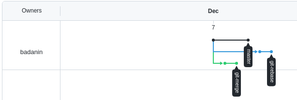
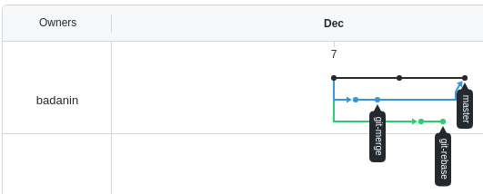
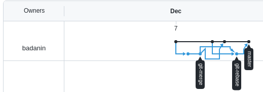

# Домашнее задание к занятию «2.3. Ветвления в Git»
## Задание №1 – Ветвление, merge и rebase.

Создадим два файла `merge.sh` и `rebase.sh`

```
echo '#!/bin/bash
# display command line options

count=1
for param in "$*"; do
    echo "\$* Parameter #$count = $param"
    count=$(( $count + 1 ))
done' | tee -a merge.sh rebase.sh
```
Добавим их и создадим коммит в основную ветку

	git add -A
	git commit -m 'prepare for merge and rebase'
	git remote add github git@github.com:badanin/02-git-03-branching.git
	git push -u github master
---
**Подготовка файла merge.sh.**
Создадим новую ветку

	git branch git-merge
	git switch git-merge

Заменим символы `*` на `@`

	sed -i 's/*/@/' merge.sh

Создадим коммит и отправим в репозиторий

	git commit -a -m "merge: @ instead *"
	git push -u github --all

Внесем изменения в `merge.sh`

```
echo '#!/bin/bash
# display command line options

count=1
while [[ -n "$1" ]]; do
    echo "Parameter #$count = $1"
    count=$(( $count + 1 ))
    shift
done' > merge.sh
```

Создадим коммит и отравим в репозиторий

	git commit -a -m 'merge: use shift'
	git push -u github --all
---
**Изменим main.**

Перейдем на ветку `main`

	git switch master

Изменим `rebase.sh`

	sed -i 's/*/@/' rebase.sh
	echo '
	echo "====="' >> rebase.sh

Создадим коммит и отравим в репозиторий

	git commit -a -m 'add echo'
	git push -u github master
---
**Подготовка файла rebase.sh.**

Найдем и перейдем в первоначальный коммит

	git log --oneline

>24fab22 (HEAD -> master, github/master) add echo  
>**077e6c0** prepare for merge and rebase

	git checkout 077e6c0
	git switch -c git-rebase

Изменим `rebase.sh` и закоммитим

	sed -i 's/*/@/' rebase.sh
	sed -i '/echo/c\    echo "Parameter: $param"' rebase.sh
	echo '
	echo "====="' >> rebase.sh

	git commit -a -m 'git-rebase 1'

Изменим `rebase.sh` еще раз, закоммитим и отправим в репозиторий

	sed -i '/Parameter/c\    echo "Next parameter: $param"' rebase.sh
	git commit -a -m 'git-rebase 2'
	git push -u github git-rebase
---
**Промежуточный итог.**


---
**Merge**

Сливаем ветку `git-merge` в `main`

	git switch master
	git merge git-merge

>Merge made by the 'recursive' strategy.  
> merge.sh | 5 +++--  
> 1 file changed, 3 insertions(+), 2 deletions(-)

	git push

>Enumerating objects: 4, done.  
>Counting objects: 100% (4/4), done.  
>Delta compression using up to 12 threads  
>Compressing objects: 100% (2/2), done.  
>Writing objects: 100% (2/2), 300 bytes | 300.00 KiB/s, done.  
>Total 2 (delta 0), reused 0 (delta 0), pack-reused 0  
>To github.com:badanin/02-git-03-branching.git  
>   24fab22..296318d  master -> master


---
**Rebase**

Выполним `rebase` на `main`

	git switch git-rebase
	git rebase -i master


>pick c995c72 git-rebase 1  
>fixup 8db0993 git-rebase 2  
>  
>Auto-merging rebase.sh  
>CONFLICT (content): Merge conflict in rebase.sh  
>error: could not apply c995c72... git-rebase 1  
>Resolve all conflicts manually, mark them as resolved with  
>"git add/rm <conflicted_files>", then run "git rebase --continue".  
>You can instead skip this commit: run "git rebase --skip".  
>To abort and get back to the state before "git rebase", run "git rebase --abort".  
>Could not apply c995c72... git-rebase 1

Устраним конфликты

	cat -n rebase.sh
	
>  1	#!/bin/bash  
>  2	# display command line options  
>  3  
>  4	count=1  
>  5	for param in "$@"; do  
>  6	<<<<<<< HEAD  
>  7	    echo "\$@ Parameter #$count = $param"  
>  8	=======  
>  9	    echo "Parameter: $param"  
>  10	>>>>>>> c995c72 (git-rebase 1)  
>  11	    count=$(( $count + 1 ))  
>  12	done  
>  13  
>  14	echo "====="

Удалим строчки 6, 8-10

	sed -i '8,10d;6d' rebase.sh

Конечный результат

	cat rebase.sh

>  #!/bin/bash  
>  # display command line options  
>  
>  count=1  
>  for param in "$@"; do  
>  echo "\$@ Parameter #$count = $param"  
>  count=$(( $count + 1 ))  
>  done  
>  
>  echo "====="

Добавим файл и продолжим `rebase`

	git add rebase.sh
	git rebase --continue

> Auto-merging rebase.sh  
> CONFLICT (content): Merge conflict in rebase.sh  
> error: could not apply 8db0993... git-rebase 2  
> Resolve all conflicts manually, mark them as resolved with  
> "git add/rm <conflicted_files>", then run "git rebase --continue".  
> You can instead skip this commit: run "git rebase --skip".  
> To abort and get back to the state before "git rebase", run "git rebase --abort".  
> Could not apply 8db0993... git-rebase 2

Устраним конфликты 

	cat -n rebase.sh

> 1	#!/bin/bash  
> 2	# display command line options  
> 3  
> 4	count=1  
> 5	for param in "$@"; do  
> 6	<<<<<<< HEAD  
> 7	    echo "\$@ Parameter #$count = $param"  
> 8	=======  
> 9	    echo "Next parameter: $param"  
> 10	>>>>>>> 8db0993 (git-rebase 2)  
> 11	    count=$(( $count + 1 ))  
> 12	done  
> 13  
> 14	echo "====="

Удалим строчки 6-8, 10

	sed -i '10d;6,8d' rebase.sh

Добавим файл и продолжим `rebase`

	git add rebase.sh
	git rebase --continue


>[detached HEAD 41ad72a] Merge branch 'git-merge'  
> Date: Tue Dec 7 15:03:29 2021 +0300  
>Successfully rebased and updated refs/heads/git-rebase.

При отправке на репозиторий возникает ошибка

	git push -u github git-rebase

>To github.com:badanin/02-git-03-branching.git  
> ! [rejected]        git-rebase -> git-rebase (non-fast-forward)  
>error: failed to push some refs to 'github.com:badanin/02-git-03-branching.git'  
>hint: Updates were rejected because the tip of your current branch is behind  
>hint: its remote counterpart. Integrate the remote changes (e.g.  
>hint: 'git pull ...') before pushing again.  
>hint: See the 'Note about fast-forwards' in 'git push --help' for details.  

Повторим с флагом `force`

	git push -u github git-rebase -f

>Enumerating objects: 7, done.  
>Counting objects: 100% (7/7), done.  
>Delta compression using up to 12 threads  
>Compressing objects: 100% (3/3), done.  
>Writing objects: 100% (3/3), 361 bytes | 361.00 KiB/s, done.  
>Total 3 (delta 1), reused 0 (delta 0), pack-reused 0  
>remote: Resolving deltas: 100% (1/1), completed with 1 local object.  
>To github.com:badanin/02-git-03-branching.git  
> + 8db0993...41ad72a git-rebase -> git-rebase (forced update)  
>Branch 'git-rebase' set up to track remote branch 'git-rebase' from 'github'.

Выполним `merge`

	git switch master
	git merge git-rebase

>Merge made by the 'recursive' strategy.  
> rebase.sh | 2 +-  
> 1 file changed, 1 insertion(+), 1 deletion(-)
 
 **Результат**
 
	git push


