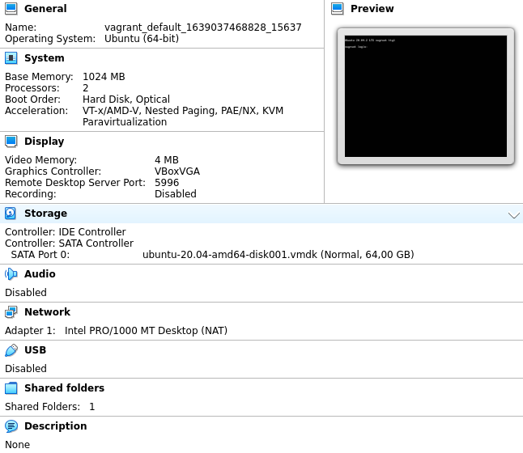

**1. Установите средство виртуализации Oracle VirtualBox.**

	wget https://download.virtualbox.org/virtualbox/6.1.30/virtualbox-6.1_6.1.30-148432~Debian~bullseye_amd64.deb
	sudo apt install ./virtualbox-6.1_6.1.30-148432~Debian~bullseye_amd64.deb

**2. Установите средство автоматизации Hashicorp Vagrant.**

	curl -fsSL https://apt.releases.hashicorp.com/gpg | sudo apt-key add -
	sudo apt-add-repository "deb [arch=amd64] https://apt.releases.hashicorp.com $(lsb_release -cs) main"
	sudo apt-get update && sudo apt-get install vagrant

**3. В вашем основном окружении подготовьте удобный для дальнейшей работы терминал.**

	uname -a

>Linux vagrant 5.10.0-9-amd64 #1 SMP Debian 5.10.70-1 (2021-09-30) x86_64 GNU/Linux

	apt show gnome-terminal

>Package: gnome-terminal  
>Version: 3.38.3-1  


**4. С помощью базового файла конфигурации запустите Ubuntu 20.04 в VirtualBox посредством Vagrant:**

	mkdir vagrant
	cd vagrant/
	vagrant init
	echo 'Vagrant.configure("2") do |config|
	  config.vm.box = "bento/ubuntu-20.04"
	end' > Vagrantfile
	vagrant up

---

```
Bringing machine 'default' up with 'virtualbox' provider...
==> default: Box 'bento/ubuntu-20.04' could not be found. Attempting to find and install...
    default: Box Provider: virtualbox
    default: Box Version: >= 0
==> default: Loading metadata for box 'bento/ubuntu-20.04'
    default: URL: https://vagrantcloud.com/bento/ubuntu-20.04
==> default: Adding box 'bento/ubuntu-20.04' (v202107.28.0) for provider: virtualbox
    default: Downloading: https://vagrantcloud.com/bento/boxes/ubuntu-20.04/versions/202107.28.0/providers/virtualbox.box
==> default: Successfully added box 'bento/ubuntu-20.04' (v202107.28.0) for 'virtualbox'!
==> default: Importing base box 'bento/ubuntu-20.04'...
==> default: Matching MAC address for NAT networking...
==> default: Checking if box 'bento/ubuntu-20.04' version '202107.28.0' is up to date...
==> default: Setting the name of the VM: vagrant_default_1639037468828_15637
Vagrant is currently configured to create VirtualBox synced folders with
the `SharedFoldersEnableSymlinksCreate` option enabled. If the Vagrant
guest is not trusted, you may want to disable this option. For more
information on this option, please refer to the VirtualBox manual:

  https://www.virtualbox.org/manual/ch04.html#sharedfolders

This option can be disabled globally with an environment variable:

  VAGRANT_DISABLE_VBOXSYMLINKCREATE=1

or on a per folder basis within the Vagrantfile:

  config.vm.synced_folder '/host/path', '/guest/path', SharedFoldersEnableSymlinksCreate: false
==> default: Clearing any previously set network interfaces...
==> default: Preparing network interfaces based on configuration...
    default: Adapter 1: nat
==> default: Forwarding ports...
    default: 22 (guest) => 2222 (host) (adapter 1)
==> default: Booting VM...
==> default: Waiting for machine to boot. This may take a few minutes...
    default: SSH address: 127.0.0.1:2222
    default: SSH username: vagrant
    default: SSH auth method: private key
    default: 
    default: Vagrant insecure key detected. Vagrant will automatically replace
    default: this with a newly generated keypair for better security.
    default: 
    default: Inserting generated public key within guest...
    default: Removing insecure key from the guest if it's present...
    default: Key inserted! Disconnecting and reconnecting using new SSH key...
==> default: Machine booted and ready!
==> default: Checking for guest additions in VM...
==> default: Mounting shared folders...
    default: /vagrant => /home/a/vagrant
```

**5. Ознакомьтесь с графическим интерфейсом VirtualBox, посмотрите как выглядит виртуальная машина, которую создал для вас Vagrant, какие аппаратные ресурсы ей выделены. Какие ресурсы выделены по-умолчанию?**
> 


**6. Ознакомьтесь с возможностями конфигурации VirtualBox через Vagrantfile: документация. Как добавить оперативной памяти или ресурсов процессора виртуальной машине?**

	config.vm.provider "virtualbox" do |v|
	  v.memory = 1024
	  v.cpus = 2
	end

**7. Команда vagrant ssh из директории, в которой содержится Vagrantfile, позволит вам оказаться внутри виртуальной машины без каких-либо дополнительных настроек. Попрактикуйтесь в выполнении обсуждаемых команд в терминале Ubuntu.**

	vagrant ssh

---

```
Welcome to Ubuntu 20.04.2 LTS (GNU/Linux 5.4.0-80-generic x86_64)

 * Documentation:  https://help.ubuntu.com
 * Management:     https://landscape.canonical.com
 * Support:        https://ubuntu.com/advantage

  System information as of Thu 09 Dec 2021 08:35:13 AM UTC

  System load:  0.04              Processes:             110
  Usage of /:   2.4% of 61.31GB   Users logged in:       0
  Memory usage: 15%               IPv4 address for eth0: 10.0.2.15
  Swap usage:   0%


This system is built by the Bento project by Chef Software
More information can be found at https://github.com/chef/bento
vagrant@vagrant:~$ 

```

**8. Ознакомиться с разделами man bash, почитать о настройках самого bash:**

	man bash

- какой переменной можно задать длину журнала history, и на какой строчке manual это описывается?

```
Manual page bash(1) line 807:

       HISTSIZE
              The  number of commands to remember in the command history (see HISTORY below).  If the value is 0, commands are not saved in the history list.  Numeric values less than zero result in every command being saved on  the  history  list (there is no limit).  The shell sets the default value to 500 after reading any startup files.
```

- что делает директива ignoreboth в bash?

```
Manual page bash(1) line 781

HISTCONTROL
              A  colon-separated list of values controlling how commands are saved on the history list.  If the list of values includes ignorespace, lines which begin with a space character are not saved in the history  list.   A  value  of  ignoredups  causes  lines matching the previous history entry to not be saved.  A value of ignoreboth is shorthand for ignorespace and ignoredups.
```

**9. В каких сценариях использования применимы скобки {} и на какой строчке man bash это описано?**

```
 Manual page bash(1) line 245

       { list; }
              list is simply executed in the current shell environment.  list must be terminated  with  a  newline  or  semicolon. This  is  known as a group command.  The return status is the exit status of list.  Note that unlike the metacharacters ( and ), { and } are reserved words and must occur where a reserved word is permitted to be recognized. Since  they do not cause a word break, they must be separated from list by whitespace or another shell metacharacter.
```

```
Manual page bash(1) line 1021

   Brace Expansion
       Brace  expansion  is a mechanism by which arbitrary strings may be generated.......
```

**10. Основываясь на предыдущем вопросе, как создать однократным вызовом touch 100000 файлов? А получилось ли создать 300000? Если нет, то почему?**

	touch f{000001..100000}
	ls

>f000001  f006668  f013335  f020002  f026669  f033336  f040003  f046670  f053337  f060004  f066671  f073338  f080005  f086672  f093339  
>f000002  f006669  f013336  f020003  f026670  f033337  f040004  f046671  f053338  f060005  f066672  f073339  f080006  f086673  f093340  
>...

	touch f{000001..300000}

>-bash: /usr/bin/touch: Argument list too long

	getconf ARG_MAX

>2097152


**11. В man bash поищите по /\[\[. Что делает конструкция [[ -d /tmp ]]**

```
Manual page bash(1) line 252

       [[ expression ]]
              Return  a status of 0 or 1 depending on the evaluation of the conditional expression expression.  Expressions are composed of the primaries described below under CONDITIONAL EXPRESSIONS.  Word splitting and pathname expansion are  not  performed on  the words between the [[ and ]]; tilde expansion, parameter and variable expansion, arithmetic expansion, command sub stitution, process substitution, and quote removal are performed.  Conditional operators such as -f must be unquoted to be recognized as primaries.
```

```
Manual page bash(1) line 1677

CONDITIONAL EXPRESSIONS
       Conditional  expressions are used by the [[ compound command and the test and [ builtin commands to test file attributes and perform string and arithmetic comparisons.  The test abd [ commands determine their behavior based on the number of  arguments;  see the descriptions of those commands for any other command-specific actions.
...
       -d file
              True if file exists and is a directory.
```

**12. Основываясь на знаниях о просмотре текущих (например, PATH) и установке новых переменных; командах, которые мы рассматривали, добейтесь в выводе type -a bash в виртуальной машине наличия первым пунктом в списке:**

	type -a bash
	
>bash is /usr/bin/bash  
>bash is /bin/bash  

	mkdir /tmp/new_path_directory
	cp /bin/bash /tmp/new_path_directory/
	echo $PATH
	export PATH=/tmp/new_path_directory/:$PATH
	type -a bash
	
>bash is /tmp/new_path_directory/bash  
>bash is /usr/bin/bash  
>bash is /bin/bash  


**13. Чем отличается планирование команд с помощью batch и at?**

```
Manual page at(1) line 17

       at and batch read commands from standard input or a specified file which are to be executed at a later time, using /bin/sh.
       
       at      executes commands at a specified tim
       ...
       batch   executes commands when system load levels permit; in other words, when the load average drops below  1.5,  or  the  value specified in the invocation of atd.
```

**14. Завершите работу виртуальной машины чтобы не расходовать ресурсы компьютера и/или батарею ноутбука.**

	exit
	vagrant halt

> ==> default: Attempting graceful shutdown of VM...

