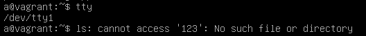

# Домашнее задание к занятию "3.2. Работа в терминале, лекция 2"

**1. Какого типа команда `cd`? Попробуйте объяснить, почему она именно такого типа; опишите ход своих мыслей, если считаете что она могла бы быть другого типа.**

	type cd

>cd is a shell builtin

[https://www.gnu.org/savannah-checkouts/gnu/bash/manual/bash.html#Shell-Builtin-Commands](https://www.gnu.org/savannah-checkouts/gnu/bash/manual/bash.html#Shell-Builtin-Commands)
"Встроенные команды содержатся в самой оболочке. Когда имя встроенной команды используется в качестве первого слова простой команды, оболочка выполняет команду напрямую, не вызывая другую программу. Встроенные команды необходимы для реализации функций, которые невозможно или неудобно получить с помощью отдельных утилит."
Она могла бы быть реализована в виде отдельного исполняемого файла.

**2. Какая альтернатива без `pipe` команде grep `<some_string>` `<some_file> | wc -l? man grep` поможет в ответе на этот вопрос. Ознакомьтесь с документом о других подобных некорректных вариантах использования pipe.**

	echo -e '123\n123\n123\n321\n321\n' > file
	grep -c 123 file

>3

**3. Какой процесс с `PID 1` является родителем для всех процессов в вашей виртуальной машине Ubuntu 20.04?**

ps -p 1

>    PID TTY          TIME CMD  
>      1 ?        00:00:01 systemd  

**4. Как будет выглядеть команда, которая перенаправит вывод `stderr ls` на другую сессию терминала?**


	terminal_1: tty
	
>/dev/pts/0

	terminal_2: tty

>/dev/pts/1

	terminal_1: ls unknown_file 2>/dev/pts/1
	
>terminal_2: ls: cannot access 'unknown_file': No such file or directory

**5. Получится ли одновременно передать команде файл на `stdin` и вывести ее `stdout` в другой файл? Приведите работающий пример.**

	sed 's/123/111/' < file > file2
	cat file2

>111  
>111  
>111  
>321  
>321  

**6. Получится ли вывести находясь в графическом режиме данные из `PTY` в какой-либо из эмуляторов `TTY`? Сможете ли вы наблюдать выводимые данные?**

	pty: tty
	
>/dev/pts/0

	pty: ls 123 2> /dev/tty1

>

**7. Выполните команду `bash 5>&1`. К чему она приведет? Что будет, если вы выполните `echo netology > /proc/$$/fd/5`? Почему так происходит?**

	bash 5>&1
	echo netology > /proc/$$/fd/5

>netology

	lsof -p $$
	
>bash    1209 vagrant    0u   CHR  136,0      0t0      3 /dev/pts/0  
>bash    1209 vagrant    1u   CHR  136,0      0t0      3 /dev/pts/0  
>bash    1209 vagrant    2u   CHR  136,0      0t0      3 /dev/pts/0  
>**bash    1209 vagrant    5u   CHR  136,0      0t0      3 /dev/pts/0**  
>bash    1209 vagrant  255u   CHR  136,0      0t0      3 /dev/pts/0  

У процесса `bash` создается новый файловый дескриптор, который перенаправляется на его `stdout`.

**8. Получится ли в качестве входного потока для `pipe` использовать только `stderr` команды, не потеряв при этом отображение `stdout` на `pty`?**

	ls file1 file2 file3 5>&1 1>&2 2>&5 | wc -l

>file1
>2


**9. Что выведет команда `cat /proc/$$/environ`? Как еще можно получить аналогичный по содержанию вывод?**

	cat /proc/$$/environ
>SHELL=/bin/bashLANGUAGE=en_US:LC_ADDRESS=C.UTF-8LC_NAME=C.UTF-8LC_MONETARY=C.UTF-8PWD=/home/vagrantLOGNAME=vagrantXDG_SESSION_TYPE=ttyMOTD_SHOWN=pamHOME=/home/vagrantLC_PAPER=C.UTF-8LANG=C.UTF-8LS_COLORS=rs=0:di=01;34:ln=01;36:mh=00:pi=40;33:so=01;35:do=01;35:bd=40;33;01:cd=40;33;01:or=40;31;01:mi=00:su=37;41:sg=30;43:ca=30;41:tw=30;42:ow=34;42:st=37;44:ex=01;32:*.tar=01;31:*.tgz=01;31:*.arc=01;31:*.arj=01;31:*.taz=01;31:*.lha=01;31:*.lz4=01;31:*.lzh=01;31:*.lzma=01;31:*.tlz=01;31:*.txz=01;31:*.tzo=01;31:*.t7z=01;31:*.zip=01;31:*.z=01;31:*.dz=01;31:*.gz=01;31:*.lrz=01;31:*.lz=01;31:*.lzo=01;31:*.xz=01;31:*.zst=01;31:*.tzst=01;31:*.bz2=01;31:*.bz=01;31:*.tbz=01;31:*.tbz2=01;31:*.tz=01;31:*.deb=01;31:*.rpm=01;31:*.jar=01;31:*.war=01;31:*.ear=01;31:*.sar=01;31:*.rar=01;31:*.alz=01;31:*.ace=01;31:*.zoo=01;31:*.cpio=01;31:*.7z=01;31:*.rz=01;31:*.cab=01;31:*.wim=01;31:*.swm=01;31:*.dwm=01;31:*.esd=01;31:*.jpg=01;35:*.jpeg=01;35:*.mjpg=01;35:*.mjpeg=01;35:*.gif=01;35:*.bmp=01;35:*.pbm=01;35:*.pgm=01;35:*.ppm=01;35:*.tga=01;35:*.xbm=01;35:*.xpm=01;35:*.tif=01;35:*.tiff=01;35:*.png=01;35:*.svg=01;35:*.svgz=01;35:*.mng=01;35:*.pcx=01;35:*.mov=01;35:*.mpg=01;35:*.mpeg=01;35:*.m2v=01;35:*.mkv=01;35:*.webm=01;35:*.ogm=01;35:*.mp4=01;35:*.m4v=01;35:*.mp4v=01;35:*.vob=01;35:*.qt=01;35:*.nuv=01;35:*.wmv=01;35:*.asf=01;35:*.rm=01;35:*.rmvb=01;35:*.flc=01;35:*.avi=01;35:*.fli=01;35:*.flv=01;35:*.gl=01;35:*.dl=01;35:*.xcf=01;35:*.xwd=01;35:*.yuv=01;35:*.cgm=01;35:*.emf=01;35:*.ogv=01;35:*.ogx=01;35:*.aac=00;36:*.au=00;36:*.flac=00;36:*.m4a=00;36:*.mid=00;36:*.midi=00;36:*.mka=00;36:*.mp3=00;36:*.mpc=00;36:*.ogg=00;36:*.ra=00;36:*.wav=00;36:*.oga=00;36:*.opus=00;36:*.spx=00;36:*.xspf=00;36:SSH_CONNECTION=10.0.2.2 55736 10.0.2.15 22LESSCLOSE=/usr/bin/lesspipe %s %sXDG_SESSION_CLASS=userTERM=xterm-256colorLC_IDENTIFICATION=C.UTF-8LESSOPEN=| /usr/bin/lesspipe %sUSER=vagrantSHLVL=1LC_TELEPHONE=C.UTF-8LC_MEASUREMENT=C.UTF-8XDG_SESSION_ID=9LC_CTYPE=C.UTF-8XDG_RUNTIME_DIR=/run/user/1000SSH_CLIENT=10.0.2.2 55736 22LC_TIME=C.UTF-8LC_COLLATE=C.UTF-8XDG_DATA_DIRS=/usr/local/share:/usr/share:/var/lib/snapd/desktopPATH=/usr/local/sbin:/usr/local/bin:/usr/sbin:/usr/bin:/sbin:/bin:/usr/games:/usr/local/games:/snap/binDBUS_SESSION_BUS_ADDRESS=unix:path=/run/user/1000/busSSH_TTY=/dev/pts/0LC_NUMERIC=C.UTF-8_=/usr/bin/bash

Выводить содержание `environment` текущей сессии.

**10. Используя man, опишите что доступно по адресам `/proc/<PID>/cmdline`, `/proc/<PID>/exe`.**

	man proc

```
 Manual page proc(5) line 235

        /proc/[pid]/cmdline
              This  read-only  file  holds  the complete command line for the process, unless the process is a
              zombie.  In the latter case, there is nothing in this file: that is, a read on  this  file  will
              return  0  characters.  The command-line arguments appear in this file as a set of strings sepa‐
              rated by null bytes ('\0'), with a further null byte after the last string.
```

```
 Manual page proc(5) line 290

       /proc/[pid]/exe
              Under Linux 2.2 and later, this file is a symbolic link containing the actual  pathname  of  the
              executed  command.   This symbolic link can be dereferenced normally; attempting to open it will
              open the executable.
              ...
```

**11. Узнайте, какую наиболее старшую версию набора инструкций `SSE` поддерживает ваш процессор с помощью `/proc/cpuinfo`.**

	grep -m 1 sse /proc/cpuinfo
	
>flags		: fpu vme de pse tsc msr pae mce cx8 apic sep mtrr pge mca cmov pat pse36 clflush mmx fxsr sse sse2 ht syscall nx rdtscp lm constant_tsc rep_good nopl xtopology cpuid tsc_known_freq pni pclmulqdq ssse3 cx16 pcid sse4_1 **sse4_2** x2apic movbe popcnt aes xsave avx rdrand hypervisor lahf_lm abm 3dnowprefetch invpcid_single pti fsgsbase avx2 invpcid rdseed clflushopt arch_capabilities


**12. При открытии нового окна терминала и `vagrant ssh` создается новая сессия и выделяется `pty`. Это можно подтвердить командой tty, которая упоминалась в лекции 3.2. Однако:**

	ssh localhost 'tty'

>not a tty

	ssh -t localhost 'tty'

>/dev/pts/1  
>Connection to localhost closed.  

```
Manual page ssh(1) line 347

     -t      Force pseudo-terminal allocation.  This can be used to execute arbitrary screen-
             based programs on a remote machine, which can be very useful, e.g. when implementing
             menu services.  Multiple -t options force tty allocation, even if ssh has no local
             tty.
```

**13. Бывает, что есть необходимость переместить запущенный процесс из одной сессии в другую. Попробуйте сделать это, воспользовавшись `reptyr`. Например, так можно перенести в `screen` процесс, который вы запустили по ошибке в обычной SSH-сессии.**

	terminal_1: sleep 10 && echo DONE
	terminal_1: pgrep sleep

>1422

	terminal_2: sudo reptyr -T 1422

>DONE

**14. `sudo echo string > /root/new_file` не даст выполнить перенаправление под обычным пользователем, так как перенаправлением занимается процесс shell'а, который запущен без sudo под вашим пользователем. Для решения данной проблемы можно использовать конструкцию `echo string | sudo tee /root/new_file`. Узнайте что делает команда `tee` и почему в отличие от `sudo echo` команда с `sudo tee` будет работать.**

	sudo echo string > /root/new_file

>bash: /root/new_file: Permission denied

Команда `echo` выполняется с повышением прав доступа, однако запись в файл из перенаправленного потока производится без повышения прав.

	echo string | sudo tee /root/new_file

>string

Перенаправленный поток передается команде `tee` с повышенными правами, которая его выводит в stdout и производит запись в файл.

