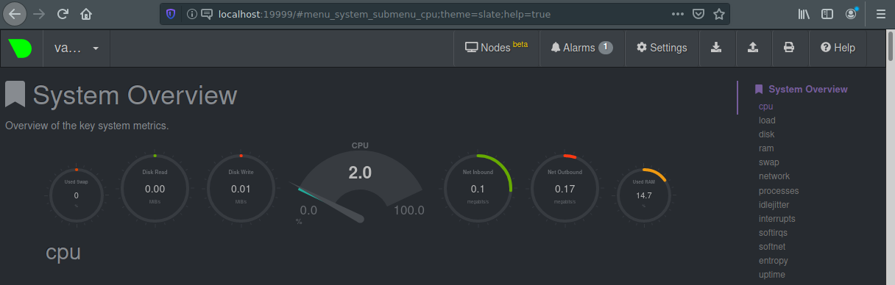

# Домашнее задание к занятию "3.4. Операционные системы"

**1. На лекции мы познакомились с `node_exporter`. В демонстрации его исполняемый файл запускался в background. Этого достаточно для демо, но не для настоящей production-системы, где процессы должны находиться под внешним управлением. Используя знания из лекции по systemd, создайте самостоятельно простой unit-файл для node_exporter:**

- поместите его в автозагрузку,
- предусмотрите возможность добавления опций к запускаемому процессу через внешний файл (посмотрите, например, на systemctl cat cron),
- удостоверьтесь, что с помощью systemctl процесс корректно стартует, завершается, а после перезагрузки автоматически поднимается.

```
wget https://github.com/prometheus/node_exporter/releases/download/v1.3.1/node_exporter-1.3.1.linux-amd64.tar.gz
tar xzf node_exporter-1.3.1.linux-amd64.tar.gz
sudo cp node_exporter-1.3.1.linux-amd64/node_exporter /usr/sbin/

echo '[Unit]
Description=Node Exporter

[Service]
EnvironmentFile=/etc/sysconfig/node_exporter
ExecStart=/usr/sbin/node_exporter $OPTIONS

[Install]
WantedBy=multi-user.target
' | sudo tee /etc/systemd/system/node_exporter.service

sudo mkdir /etc/sysconfig
echo 'OPTIONS="--collector.textfile.directory /var/lib/node_exporter/textfile_collector"' | sudo tee /etc/sysconfig/node_exporter

sudo mkdir -p /var/lib/node_exporter/textfile_collector

sudo systemctl daemon-reload
sudo systemctl enable node_exporter

sudo systemctl start node_exporter

sudo systemctl stop node_exporter.service
sudo journalctl -b -u node_exporter.service 
```

>-- Logs begin at Thu 2021-12-09 08:11:30 UTC, end at Wed 2021-12-22 07:44:27 UTC. --  
>Dec 22 07:43:03 vagrant systemd[1]: Started Node Exporter.  
>Dec 22 07:43:04 vagrant node_exporter[613]: ts=2021-12-22T07:43:04.177Z caller=node_exporter.go:182 level=info msg="Starting node_ex  
>Dec 22 07:43:04 vagrant node_exporter[613]: ts=2021-12-22T07:43:04.178Z caller=node_exporter.go:183 level=info msg="Build context" b  

**2. Ознакомьтесь с опциями node_exporter и выводом /metrics по-умолчанию. Приведите несколько опций, которые вы бы выбрали для базового мониторинга хоста по CPU, памяти, диску и сети.**

	curl http://localhost:9100/metrics

> HELP go_gc_duration_seconds A summary of the pause duration of garbage collection cycles.  
> TYPE go_gc_duration_seconds summary  
>go_gc_duration_seconds{quantile="0"} 0  
>go_gc_duration_seconds{quantile="0.25"} 0  
>go_gc_duration_seconds{quantile="0.5"} 0  
>...  

Конкретизировать метрики можно с помощью опций:

```
echo 'OPTIONS="--collector.textfile.directory /var/lib/node_exporter/textfile_collector --collector.disable-defaults --collector.cpu --collector.meminfo --collector.diskstats --collector.netclass"' | sudo tee /etc/sysconfig/node_exporter

sudo systemctl restart node_exporter.service
```
Пример полезных метрик:

- CPU
>node_cpu_seconds_total{cpu="0",mode="idle"} 2243.78
>node_cpu_seconds_total{cpu="0",mode="iowait"} 0.7
>node_cpu_seconds_total{cpu="0",mode="irq"} 0
>node_cpu_seconds_total{cpu="0",mode="nice"} 0
>node_cpu_seconds_total{cpu="0",mode="softirq"} 1.23
>node_cpu_seconds_total{cpu="0",mode="steal"} 0
>node_cpu_seconds_total{cpu="0",mode="system"} 7.41
>node_cpu_seconds_total{cpu="0",mode="user"} 2.68

- Memory
>node_memory_MemTotal_bytes 1.028694016e+09
>node_memory_MemAvailable_bytes 7.50075904e+08

- Disk
>node_filesystem_size_bytes{device="/dev/mapper/vgvagrant-root",fstype="ext4",mountpoint="/"} 6.5827115008e+10
>node_filesystem_avail_bytes{device="/dev/mapper/vgvagrant-root",fstype="ext4",mountpoint="/"} 6.0508315648e+10

- Network
>node_network_info{address="08:00:27:73:60:cf",broadcast="ff:ff:ff:ff:ff:ff",device="eth0",duplex="full",ifalias="",operstate="up"}


**3. Установите в свою виртуальную машину Netdata. Воспользуйтесь готовыми пакетами для установки (sudo apt install -y netdata). После успешной установки:**

- в конфигурационном файле /etc/netdata/netdata.conf в секции [web] замените значение с localhost на bind to = 0.0.0.0,
- добавьте в Vagrantfile проброс порта Netdata на свой локальный компьютер и сделайте vagrant reload:
config.vm.network "forwarded_port", guest: 19999, host: 19999  

```
	sudo apt install netdata -y
	sudo sed -i 's/127.0.0.1/0.0.0.0/g' /etc/netdata/netdata.conf
```

Изменим Vagrantfile виртуальной машины и перезапустим ее:

	sed -i '/^end/i \ \ config.vm.network "forwarded_port", guest: 19999, host: 19999' Vagrantfile
	vagrant reload

После успешной перезагрузки в браузере на своем ПК (не в виртуальной машине) вы должны суметь зайти на localhost:19999. Ознакомьтесь с метриками, которые по умолчанию собираются Netdata и с комментариями, которые даны к этим метрикам.



**4. Можно ли по выводу dmesg понять, осознает ли ОС, что загружена не на настоящем оборудовании, а на системе виртуализации?**

	sudo dmesg | grep -iE 'virt|kvm|vbox'

>[    0.000000] DMI: innotek GmbH VirtualBox/VirtualBox, BIOS VirtualBox 12/01/2006  
>[    0.000000] Hypervisor detected: KVM  
>[    0.000000] kvm-clock: Using msrs 4b564d01 and 4b564d00  
>[    0.000000] kvm-clock: cpu 0, msr 11601001, primary cpu clock  
>[    0.000000] kvm-clock: using sched offset of 14143683037 cycles  
>[    0.000010] clocksource: kvm-clock: mask: 0xffffffffffffffff max_cycles: 0x1cd42e4dffb, max_idle_ns: 881590591483 ns  
>[    0.012484] CPU MTRRs all blank - virtualized system.  
>[    1.385087] ACPI: RSDP 0x00000000000E0000 000024 (v02 VBOX  )  
>[    1.385090] ACPI: XSDT 0x000000003FFF0030 00003C (v01 VBOX   VBOXXSDT 00000001 ASL  00000061)  
>[    1.385099] ACPI: FACP 0x000000003FFF00F0 0000F4 (v04 VBOX   VBOXFACP 00000001 ASL  00000061)  
>[    1.385103] ACPI: DSDT 0x000000003FFF0470 002325 (v02 VBOX   VBOXBIOS 00000002 INTL 20200925)  
>[    1.385110] ACPI: APIC 0x000000003FFF0240 00005C (v02 VBOX   VBOXAPIC 00000001 ASL  00000061)  
>[    1.385112] ACPI: SSDT 0x000000003FFF02A0 0001CC (v01 VBOX   VBOXCPUT 00000002 INTL 20200925)  
>[    1.398792] Booting paravirtualized kernel on KVM  
>[    0.119951] kvm-clock: cpu 1, msr 11601041, secondary cpu clock  
>[    2.090207] clocksource: Switched to clocksource kvm-clock  
>[    2.807799] vboxvideo: loading out-of-tree module taints kernel.  
>[    2.807814] vboxvideo: module verification failed: signature and/or required key missing - tainting kernel  
>[    2.808642] vboxvideo: loading version 6.1.24 r145751  
>[    2.883879] fbcon: vboxvideodrmfb (fb0) is primary device  
>[    2.890193] vboxvideo 0000:00:02.0: fb0: vboxvideodrmfb frame buffer device  
>[    2.924254] [drm] Initialized vboxvideo 1.0.0 20130823 for 0000:00:02.0 on minor 0  
>[    3.115102] ata3.00: ATA-6: VBOX HARDDISK, 1.0, max UDMA/133  
>[    3.116037] scsi 2:0:0:0: Direct-Access     ATA      VBOX HARDDISK    1.0  PQ: 0 ANSI: 5  
>[    6.535974] systemd[1]: Detected virtualization oracle.  
>[    7.521235] vboxguest: Successfully loaded version 6.1.24 r145751  
>[    7.521364] vboxguest: misc device minor 58, IRQ 20, I/O port d020, MMIO at 00000000f0400000 (size 0x400000)  
>[    7.521365] vboxguest: Successfully loaded version 6.1.24 r145751 (interface 0x00010004)  
>[    9.187558] 08:55:38.282648 main     VBoxService 6.1.24 r145751 (verbosity: 0) linux.amd64 (Jul 15 2021 18:33:29) release log  
>[    9.188139] 08:55:38.283277 main     Executable: /opt/VBoxGuestAdditions-6.1.24/sbin/VBoxService  
>[   11.394023] vboxsf: g_fHostFeatures=0x8000000f g_fSfFeatures=0x1 g_uSfLastFunction=29  
>[   11.394450] *** VALIDATE vboxsf ***  
>[   11.394454] vboxsf: Successfully loaded version 6.1.24 r145751  
>[   11.394580] vboxsf: Successfully loaded version 6.1.24 r145751 on 5.4.0-80-generic SMP mod_unload modversions  (LINUX_VERSION_CODE=0x5047c)  
>[   11.397509] vboxsf: SHFL_FN_MAP_FOLDER failed for '/vagrant': share not found  


**5. Как настроен sysctl fs.nr_open на системе по-умолчанию? Узнайте, что означает этот параметр. Какой другой существующий лимит не позволит достичь такого числа (ulimit --help)?**

	sysctl fs.nr_open

>fs.nr_open = 1048576  

```
Manual page proc(5) line 2406

       /proc/sys/fs/nr_open (since Linux 2.6.25)
              This  file imposes ceiling on the value to which the RLIMIT_NOFILE resource limit can be raised (see getrlimit(2)).
              This ceiling is enforced for both unprivileged and privileged process.  The default value in this file is  1048576.
              (Before Linux 2.6.25, the ceiling for RLIMIT_NOFILE was hard-coded to the same value.)

Manual page getrlimit(2) line 122

       RLIMIT_NOFILE
              This specifies a value one greater than the maximum file descriptor number that can be opened by this process.  At‐
              tempts  (open(2),  pipe(2),  dup(2), etc.)  to exceed this limit yield the error EMFILE.  (Historically, this limit
              was named RLIMIT_OFILE on BSD.)

              Since Linux 4.5, this limit also defines the maximum number of file descriptors that an unprivileged  process  (one
              without  the  CAP_SYS_RESOURCE capability) may have "in flight" to other processes, by being passed across UNIX do‐
              main sockets.  This limit applies to the sendmsg(2) system call.  For further details, see unix(7).
```

	ulimit -a

>core file size          (blocks, -c) 0  
>data seg size           (kbytes, -d) unlimited  
>scheduling priority             (-e) 0  
>file size               (blocks, -f) unlimited  
>pending signals                 (-i) 3571  
>max locked memory       (kbytes, -l) 65536  
>max memory size         (kbytes, -m) unlimited  
>**open files                      (-n) 1024**  
>pipe size            (512 bytes, -p) 8  
>POSIX message queues     (bytes, -q) 819200  
>real-time priority              (-r) 0  
>stack size              (kbytes, -s) 8192  
>cpu time               (seconds, -t) unlimited  
>max user processes              (-u) 3571  
>virtual memory          (kbytes, -v) unlimited  
>file locks                      (-x) unlimited  

**6. Запустите любой долгоживущий процесс (не ls, который отработает мгновенно, а, например, sleep 1h) в отдельном неймспейсе процессов; покажите, что ваш процесс работает под PID 1 через nsenter. Для простоты работайте в данном задании под root (sudo -i). Под обычным пользователем требуются дополнительные опции (--map-root-user) и т.д.**

	unshare -f -p --mount-proc /usr/bin/sleep 1h

	sudo ps aux | grep sleep

>root        1996  0.0  0.0   9828   596 pts/0    S+   09:51   0:00 unshare -f -p --mount-proc /usr/bin/sleep 1h  
>root        **1997**  0.0  0.0   9824   592 pts/0    S+   09:51   0:00 **/usr/bin/sleep 1h**  

	nsenter --target 1997 --pid --mount

>USER         PID %CPU %MEM    VSZ   RSS TTY      STAT START   TIME COMMAND  
>root           **1**  0.0  0.0   9824   592 pts/0    S+   09:51   0:00 **/usr/bin/sleep 1h**  
>...  

**7. Найдите информацию о том, что такое :(){ :|:& };:. Запустите эту команду в своей виртуальной машине Vagrant с Ubuntu 20.04 (это важно, поведение в других ОС не проверялось). Некоторое время все будет "плохо", после чего (минуты) – ОС должна стабилизироваться. Вызов dmesg расскажет, какой механизм помог автоматической стабилизации. Как настроен этот механизм по-умолчанию, и как изменить число процессов, которое можно создать в сессии?**

[Fork-Бомба](https://ru.wikipedia.org/wiki/Fork-%D0%B1%D0%BE%D0%BC%D0%B1%D0%B0#cite_note-2)

	:(){ :|:& };:

>...  
>bash: fork: retry: Resource temporarily unavailable  
>bash: fork: retry: Resource temporarily unavailable  
>bash: fork: Resource temporarily unavailable  
>bash: fork: Resource temporarily unavailable  
>bash: fork: retry: Resource temporarily unavailable  
>bash: fork: Resource temporarily unavailable  
>...  

	sudo dmesg | tail -5

>[   12.046685] cfg80211: Loading compiled-in X.509 certificates for regulatory database  
>[   12.048016] cfg80211: Loaded X.509 cert 'sforshee: 00b28ddf47aef9cea7'  
>[   12.054826] platform regulatory.0: Direct firmware load for regulatory.db failed with error -2  
>[   12.054828] cfg80211: failed to load regulatory.db  
>**[ 3836.361347] cgroup: fork rejected by pids controller in /user.slice/user-1000.slice/session-3.scope**  

	cat /sys/fs/cgroup/pids/user.slice/user-1000.slice/session-3.scope/pids.max

>max  

	systemctl show -p DefaultTasksMax

>DefaultTasksMax=1071  

```
Manual page systemd.resource-control(5)

       TasksMax=N
           Specify the maximum number of tasks that may be created in the unit. This ensures that the number of tasks accounted
           for the unit (see above) stays below a specific limit. This either takes an absolute number of tasks or a percentage
           value that is taken relative to the configured maximum number of tasks on the system. If assigned the special value
           "infinity", no tasks limit is applied. This controls the "pids.max" control group attribute. For details about this
           control group attribute, see Process Number Controller[7].

           The system default for this setting may be controlled with DefaultTasksMax= in systemd-system.conf(5).
```
