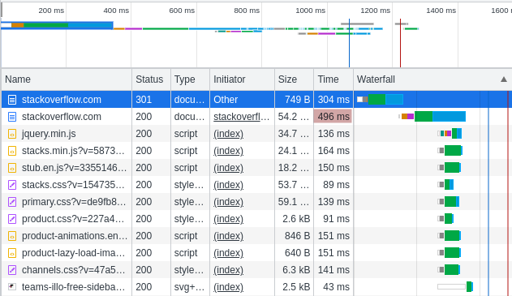
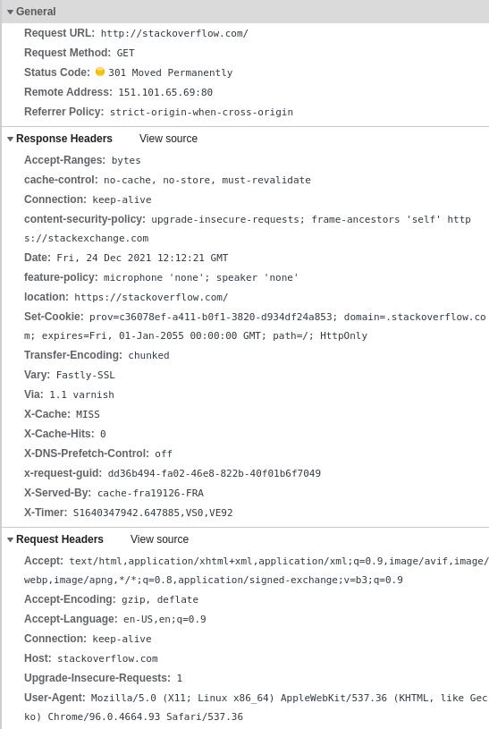

# Домашнее задание к занятию "3.6. Компьютерные сети, лекция 1"

**1. Работа c HTTP через телнет.**

- Подключитесь утилитой телнет к сайту stackoverflow.com telnet stackoverflow.com 80  
- Отправьте HTTP запрос.  
- В ответе укажите полученный HTTP код, что он означает?  

```
telnet stackoverflow.com 80

GET /questions HTTP/1.0
HOST: stackoverflow.com
```

>HTTP/1.1 301 Moved Permanently  
>cache-control: no-cache, no-store, must-revalidate  
>location: https://stackoverflow.com/questions  
>x-request-guid: dcca36da-ede5-4da2-bbb8-6bb0666f725a  
>feature-policy: microphone 'none'; speaker 'none'  
>content-security-policy: upgrade-insecure-requests; frame-ancestors 'self' https://stackexchange.com  
>Accept-Ranges: bytes  
>Date: Fri, 24 Dec 2021 11:43:14 GMT  
>Via: 1.1 varnish  
>Connection: close  
>X-Served-By: cache-fra19177-FRA  
>X-Cache: MISS  
>X-Cache-Hits: 0  
>X-Timer: S1640346194.121782,VS0,VE92  
>Vary: Fastly-SSL  
>X-DNS-Prefetch-Control: off  
>Set-Cookie: prov=330a7657-1fbd-2b22-13aa-504bf18695ee; domain=.stackoverflow.com; expires=Fri, 01-Jan-2055 00:00:00 GMT; path=/; HttpOnly  
>  
>Connection closed by foreign host.  

Запрошенный ресурс был окончательно перемещён в URL, указанный в заголовке Location

**2. Повторите задание 1 в браузере, используя консоль разработчика F12.**
- откройте вкладку Network  
- отправьте запрос http://stackoverflow.com  
- найдите первый ответ HTTP сервера, откройте вкладку Headers  
- укажите в ответе полученный HTTP код.  
- проверьте время загрузки страницы, какой запрос обрабатывался дольше всего?  
- приложите скриншот консоли браузера в ответ.  


---


**3. Какой IP адрес у вас в интернете?**

	curl ifconfig.me

>95.165.8.99  

**4. Какому провайдеру принадлежит ваш IP адрес? Какой автономной системе AS? Воспользуйтесь утилитой whois**

	whois $(curl ifconfig.me)

>% This is the RIPE Database query service.  
>% The objects are in RPSL format.  
>%  
>% The RIPE Database is subject to Terms and Conditions.  
>% See http://www.ripe.net/db/support/db-terms-conditions.pdf  
>  
>% Note: this output has been filtered.  
>%       To receive output for a database update, use the "-B" flag.  
>  
>% Information related to '95.165.0.0 - 95.165.127.255'  
>  
>% Abuse contact for '95.165.0.0 - 95.165.127.255' is 'abuse@spd-mgts.ru'  
>  
>inetnum:        95.165.0.0 - 95.165.127.255  
>netname:        MGTS-PPPOE  
>descr:          **Moscow Local Telephone Network (OAO MGTS)**  
>country:        RU  
>admin-c:        USPD-RIPE  
>tech-c:         USPD-RIPE  
>status:         ASSIGNED PA  
>mnt-by:         MGTS-USPD-MNT  
>created:        2009-11-27T18:33:25Z  
>last-modified:  2009-11-27T18:33:25Z  
>source:         RIPE  
>  
>role:           PJSC Moscow City Telephone Network NOC  
>address:        USPD MGTS  
>address:        Moscow, Russia  
>address:        Khachaturyana 5  
>admin-c:        AGS9167-RIPE  
>admin-c:        AVK103-RIPE  
>admin-c:        GIA45-RIPE  
>tech-c:         AVK103-RIPE  
>tech-c:         VMK  
>tech-c:         ANO3-RIPE  
>abuse-mailbox:  abuse@spd-mgts.ru  
>nic-hdl:        USPD-RIPE  
>mnt-by:         MGTS-USPD-MNT  
>created:        2006-09-11T07:56:01Z  
>last-modified:  2021-04-13T10:41:35Z  
>source:         RIPE # Filtered  
>  
>% Information related to '95.165.0.0/16AS25513'  
>  
>route:          95.165.0.0/16  
>descr:          Moscow Local Telephone Network (OAO MGTS)  
>descr:          Moscow, Russia  
>origin:         **AS25513**  
>mnt-by:         MGTS-USPD-MNT  
>created:        2009-01-27T13:52:05Z  
>last-modified:  2009-01-27T13:52:05Z  
>source:         RIPE  
>  
>% This query was served by the RIPE Database Query Service version 1.102.2 (ANGUS)  


**5. Через какие сети проходит пакет, отправленный с вашего компьютера на адрес 8.8.8.8? Через какие AS? Воспользуйтесь утилитой traceroute**

	traceroute -An 8.8.8.8

>traceroute to 8.8.8.8 (8.8.8.8), 30 hops max, 60 byte packets  
> 1  10.0.2.2 [*]  1.015 ms  0.840 ms  2.099 ms  
> 2  192.168.1.1 [*]  3.654 ms  3.571 ms  3.491 ms  
> 3  95.165.0.1 [AS25513]  4.686 ms  6.299 ms  7.660 ms  
> 4  212.188.1.6 [AS8359]  11.174 ms  13.642 ms  13.563 ms  
> 5  212.188.1.5 [AS8359]  14.761 ms  15.881 ms *  
> 6  * 195.34.53.206 [AS8359]  13.049 ms  12.802 ms  
> 7  212.188.29.82 [AS8359]  6.305 ms  7.557 ms  8.857 ms  
> 8  108.170.250.66 [AS15169]  10.519 ms 108.170.250.130 [AS15169]  11.709 ms *  
> 9  * * 142.251.49.24 [AS15169]  29.741 ms  
>10  72.14.238.168 [AS15169]  63.278 ms 172.253.66.110 [AS15169]  34.520 ms 74.125.253.94 [AS15169]  29.936 ms  
>11  142.250.209.161 [AS15169]  34.683 ms 142.250.236.77 [AS15169]  30.750 ms 216.239.46.139 [AS15169]  30.623 ms  
>12  * * *  
>13  * * *  
>14  * * *  
>15  * * *  
>16  * * *  
>17  * * *  
>18  * * *  
>19  * * *  
>20  * * *  
>21  8.8.8.8 [AS15169]  30.218 ms  34.152 ms *  

**6. Повторите задание 5 в утилите mtr. На каком участке наибольшая задержка - delay?**

	mtr 8.8.8.8

>Host                 Loss%   Snt   Last   **Avg**  Best  Wrst StDev  
>...  
> 9. 142.251.49.24    1.0%   102   20.5  **21.3**  20.0  34.3   2.0  
>10. 209.85.254.20    0.0%   102   20.3  **21.5**  19.9  36.6   3.0  
>11. 74.125.253.147   0.0%   102   22.4  **22.2**  19.5  33.8   1.8  
>...  

**7. Какие DNS сервера отвечают за доменное имя dns.google? Какие A записи? воспользуйтесь утилитой dig**

	dig dns.google +noall +answer

>dns.google.		310	IN	A	8.8.8.8  
>dns.google.		310	IN	A	8.8.4.4  

**8. Проверьте PTR записи для IP адресов из задания 7. Какое доменное имя привязано к IP? воспользуйтесь утилитой dig**

	dig -x 8.8.8.8 +noall +answer
	
>8.8.8.8.in-addr.arpa.	2529	IN	PTR	dns.google.  

	dig -x 8.8.4.4 +noall +answer

>4.4.8.8.in-addr.arpa.	2621	IN	PTR	dns.google.  
