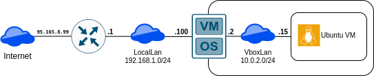

# Домашнее задание к занятию "3.8. Компьютерные сети, лекция 3"

**1. Подключитесь к публичному маршрутизатору в интернет. Найдите маршрут к вашему публичному IP**

```
telnet route-views.routeviews.org
Username: rviews

sh ip route 95.165.8.99
```

>Routing entry for 95.165.0.0/16  
>  Known via "bgp 6447", distance 20, metric 0  
>  Tag 3356, type external  
>  Last update from 4.68.4.46 1w1d ago  
>  Routing Descriptor Blocks:  
>  * 4.68.4.46, from 4.68.4.46, 1w1d ago  
>      Route metric is 0, traffic share count is 1  
>      AS Hops 3  
>      Route tag 3356  
>      MPLS label: none  

	show bgp 95.165.8.99

>BGP routing table entry for 95.165.0.0/16, version 1957709908  
>Paths: (23 available, best #9, table default)  
>  Not advertised to any peer  
>  Refresh Epoch 1  
>  3333 8359 25513  
>    193.0.0.56 from 193.0.0.56 (193.0.0.56)  
>      Origin IGP, localpref 100, valid, external  
>      Community: 0:151 8359:100 8359:5500 8359:55277  
>      path 7FE09B906118 RPKI State not found  
>      rx pathid: 0, tx pathid: 0  
>  Refresh Epoch 1  
>  6939 8359 25513  
>    64.71.137.241 from 64.71.137.241 (216.218.252.164)  
>      Origin IGP, localpref 100, valid, external  
>      path 7FE0C2FA7188 RPKI State not found  
>      rx pathid: 0, tx pathid: 0  
>  Refresh Epoch 1  
>  1351 8359 25513  
>    132.198.255.253 from 132.198.255.253 (132.198.255.253)  
>      Origin IGP, localpref 100, valid, external  
>      path 7FE036E35668 RPKI State not found  
>      rx pathid: 0, tx pathid: 0  

**2. Создайте dummy0 интерфейс в Ubuntu. Добавьте несколько статических маршрутов. Проверьте таблицу маршрутизации.**

```
sudo modprobe dummy
echo '
auto dummy0
iface dummy0 inet static
        address 10.10.10.1/32
	pre-up ip link add dummy0 type dummy
' | sudo tee -a /etc/network/interfaces

sudo ip route add 192.168.1.0/24 via 10.0.2.100
sudo ip route add 8.8.8.8/32 via 10.0.2.22
ip route
```

>default via 10.0.2.2 dev eth0 proto dhcp src 10.0.2.15 metric 100   
>8.8.8.8 via 10.0.2.22 dev eth0   
>10.0.2.0/24 dev eth0 proto kernel scope link src 10.0.2.15   
>10.0.2.2 dev eth0 proto dhcp scope link src 10.0.2.15 metric 100   
>192.168.1.0/24 via 10.0.2.100 dev eth0   

**3. Проверьте открытые TCP порты в Ubuntu, какие протоколы и приложения используют эти порты? Приведите несколько примеров.**

	sudo ss -t -a -p -n

>State    Recv-Q   Send-Q       Local Address:Port         Peer Address:Port    Process                                                                                    
>LISTEN   0        4096               0.0.0.0:**111**            0.0.0.0:*        **users:(("rpcbind",pid=558,fd=4),("systemd",pid=1,fd=93))**                                  
>LISTEN   0        4096         127.0.0.53%lo:**53**            0.0.0.0:*        **users:(("systemd-resolve",pid=559,fd=13))**                                                 
>LISTEN   0        128                0.0.0.0:**22**               0.0.0.0:*        **users:(("sshd",pid=846,fd=3))**                                                             
>ESTAB    0        0                10.0.2.15:22              10.0.2.2:41790    users:(("sshd",pid=967,fd=4),("sshd",pid=919,fd=4))                                       
>LISTEN   0        4096                  [::]:111               [::]:*        users:(("rpcbind",pid=558,fd=6),("systemd",pid=1,fd=95))                                  
>LISTEN   0        511                      :**80**                    *:*        **users:(("apache2",pid=1907,fd=4),("apache2",pid=1906,fd=4),("apache2",pid=1905,fd=4))**     
>LISTEN   0        128                   [::]:22                  [::]:*        users:(("sshd",pid=846,fd=4))     

**4. Проверьте используемые UDP сокеты в Ubuntu, какие протоколы и приложения используют эти порты?**

	sudo ss -u -a -p -n

>State        Recv-Q       Send-Q              Local Address:Port                Peer Address:Port       Process                                                           
>UNCONN       0            0                         0.0.0.0:**111**                   0.0.0.0:*           **users:(("rpcbind",pid=558,fd=5),("systemd",pid=1,fd=94))**         
>UNCONN       0            0                   127.0.0.53%lo:**53**                   0.0.0.0:*           **users:(("systemd-resolve",pid=559,fd=12))**                        
>UNCONN       0            0                  10.0.2.15%eth0:**68**                   0.0.0.0:*           **users:(("systemd-network",pid=400,fd=19))**                        
>UNCONN       0            0                            [::]:111                      [::]:*           users:(("rpcbind",pid=558,fd=7),("systemd",pid=1,fd=96))     
 
**5. Используя diagrams.net, создайте L3 диаграмму вашей домашней сети или любой другой сети, с которой вы работали.**


[netw.drawio](netw.drawio)

