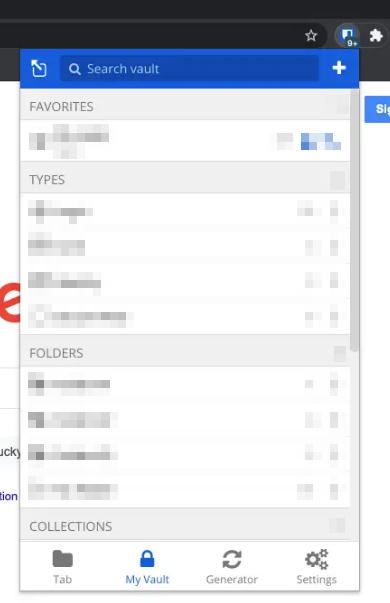
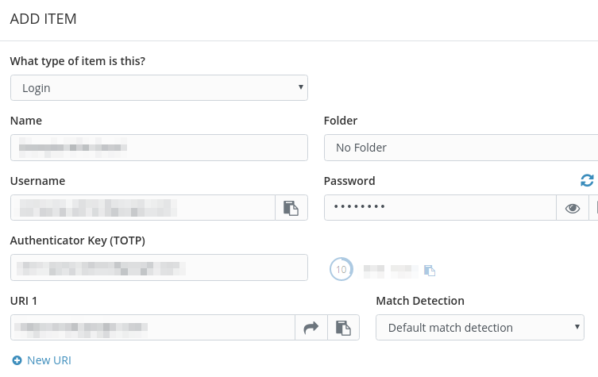
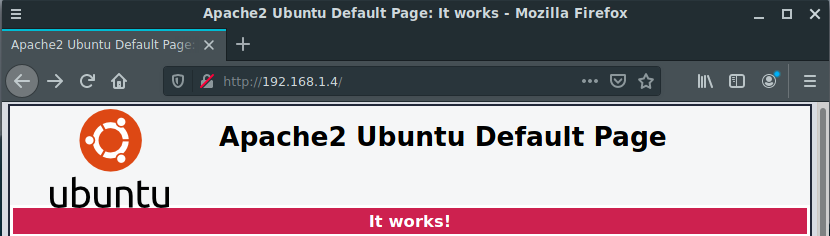
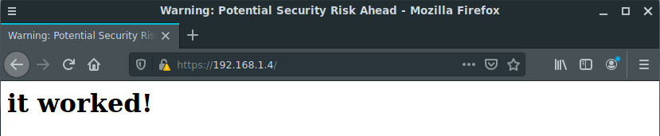
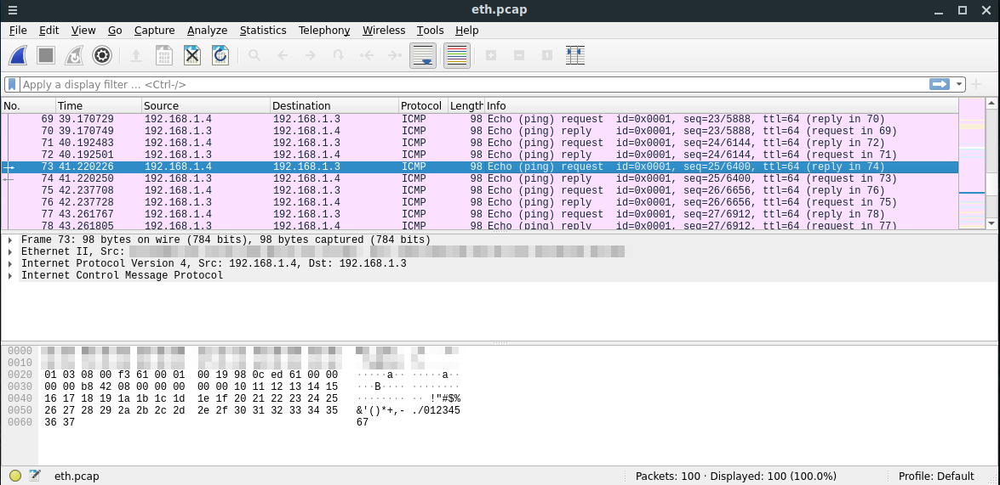

# Домашнее задание к занятию "3.9. Элементы безопасности информационных систем"

**1. Установите Bitwarden плагин для браузера. Зарегестрируйтесь и сохраните несколько паролей.**



**2. Установите Google authenticator на мобильный телефон. Настройте вход в Bitwarden акаунт через Google authenticator OTP.**



**3. Установите apache2, сгенерируйте самоподписанный сертификат, настройте тестовый сайт для работы по HTTPS.**

	sudo apt update
	sudo apt install apache2



	sudo a2enmod ssl

>Considering dependency setenvif for ssl:  
>Module setenvif already enabled  
>Considering dependency mime for ssl:  
>Module mime already enabled  
>Considering dependency socache_shmcb for ssl:  
>Enabling module socache_shmcb.  
>Enabling module ssl.  

	sudo openssl req -x509 -nodes -days 365 -newkey rsa:2048 -keyout /etc/ssl/private/apache-selfsigned.key -out /etc/ssl/certs/apache-selfsigned.crt -subj "/C=RU/ST=Moscow/L=Moscow/O=BMS/OU=ORG/CN=192.168.1.4"

>Generating a RSA private key  
>......................................+++++  
>........+++++  
>writing new private key to '/etc/ssl/private/apache-selfsigned.key'  

```
echo "
<VirtualHost *:443>
        ServerName 192.168.1.4
        DocumentRoot /var/www/192.168.1.4

        SSLEngine On
        SSLCertificateFile /etc/ssl/certs/apache-selfsigned.crt
        SSLCertificateKeyFile /etc/ssl/private/apache-selfsigned.key
</VirtualHost>
" | sudo tee /etc/apache2/sites-available/192.168.1.4.conf
```

	sudo mkdir /var/www/192.168.1.4
	echo '<h1>it worked!</h1>' | sudo tee /var/www/192.168.1.4/index.html
	sudo a2ensite 192.168.1.4.conf 

>Enabling site 192.168.1.4.  
>To activate the new configuration, you need to run:  
>  systemctl reload apache2  

	sudo apache2ctl configtest 

>Syntax OK  

	sudo systemctl reload apache2.service 



**4. Проверьте на TLS уязвимости произвольный сайт в интернете (кроме сайтов МВД, ФСБ, МинОбр, НацБанк, РосКосмос, РосАтом, РосНАНО и любых госкомпаний, объектов КИИ, ВПК ... и тому подобное).**

	./testssl.sh -e --fast --parallel https://habr.ru/

```
###########################################################
    testssl.sh       3.1dev from https://testssl.sh/dev/
    (06890d4 2022-01-10 11:19:10 -- )

      This program is free software. Distribution and
             modification under GPLv2 permitted.
      USAGE w/o ANY WARRANTY. USE IT AT YOUR OWN RISK!

       Please file bugs @ https://testssl.sh/bugs/

###########################################################

 Using "OpenSSL 1.0.2-chacha (1.0.2k-dev)" [~183 ciphers]
 on vagrant:./bin/openssl.Linux.x86_64
 (built: "Jan 18 17:12:17 2019", platform: "linux-x86_64")


 Start 2022-01-23 07:31:48        -->> 82.192.95.175:443 (habr.ru) <<--

 rDNS (82.192.95.175):   assets.habranet.net.
 Service detected:       HTTP


 Testing all 183 locally available ciphers against the server, ordered by encryption strength 


Hexcode  Cipher Suite Name (OpenSSL)       KeyExch.   Encryption  Bits     Cipher Suite Name (IANA/RFC)
-----------------------------------------------------------------------------------------------------------------------------
 xc030   ECDHE-RSA-AES256-GCM-SHA384       ECDH 256   AESGCM      256      TLS_ECDHE_RSA_WITH_AES_256_GCM_SHA384              
 x9f     DHE-RSA-AES256-GCM-SHA384         DH 4096    AESGCM      256      TLS_DHE_RSA_WITH_AES_256_GCM_SHA384                
 xc02f   ECDHE-RSA-AES128-GCM-SHA256       ECDH 256   AESGCM      128      TLS_ECDHE_RSA_WITH_AES_128_GCM_SHA256              
 x9e     DHE-RSA-AES128-GCM-SHA256         DH 4096    AESGCM      128      TLS_DHE_RSA_WITH_AES_128_GCM_SHA256                


 Done 2022-01-23 07:31:53 [   7s] -->> 82.192.95.175:443 (habr.ru) <<--
```
---
	~/testssl.sh$ ./testssl.sh -U --sneaky https://habr.ru/

```
###########################################################
    testssl.sh       3.1dev from https://testssl.sh/dev/
    (06890d4 2022-01-10 11:19:10 -- )

      This program is free software. Distribution and
             modification under GPLv2 permitted.
      USAGE w/o ANY WARRANTY. USE IT AT YOUR OWN RISK!

       Please file bugs @ https://testssl.sh/bugs/

###########################################################

 Using "OpenSSL 1.0.2-chacha (1.0.2k-dev)" [~183 ciphers]
 on vagrant:./bin/openssl.Linux.x86_64
 (built: "Jan 18 17:12:17 2019", platform: "linux-x86_64")


 Start 2022-01-23 07:32:22        -->> 82.192.95.175:443 (habr.ru) <<--

 rDNS (82.192.95.175):   assets.habranet.net.
 Service detected:       HTTP


 Testing vulnerabilities 

 Heartbleed (CVE-2014-0160)                not vulnerable (OK), timed out
 CCS (CVE-2014-0224)                       not vulnerable (OK)
 Ticketbleed (CVE-2016-9244), experiment.  not vulnerable (OK), session IDs were returned but potential memory fragments do not differ
 ROBOT                                     Server does not support any cipher suites that use RSA key transport
 Secure Renegotiation (RFC 5746)           supported (OK)
 Secure Client-Initiated Renegotiation     not vulnerable (OK)
 CRIME, TLS (CVE-2012-4929)                not vulnerable (OK)
 BREACH (CVE-2013-3587)                    no gzip/deflate/compress/br HTTP compression (OK)  - only supplied "/" tested
 POODLE, SSL (CVE-2014-3566)               not vulnerable (OK)
 TLS_FALLBACK_SCSV (RFC 7507)              No fallback possible (OK), no protocol below TLS 1.2 offered
 SWEET32 (CVE-2016-2183, CVE-2016-6329)    not vulnerable (OK)
 FREAK (CVE-2015-0204)                     not vulnerable (OK)
 DROWN (CVE-2016-0800, CVE-2016-0703)      not vulnerable on this host and port (OK)
                                           make sure you don't use this certificate elsewhere with SSLv2 enabled services
                                           https://censys.io/ipv4?q=3CA4C318A8B14348EB8C746107D2631E405AA8930D69262BF8CA3B8C596AC938 could help you to find out
 LOGJAM (CVE-2015-4000), experimental      not vulnerable (OK): no DH EXPORT ciphers, no common prime detected
 BEAST (CVE-2011-3389)                     not vulnerable (OK), no SSL3 or TLS1
 LUCKY13 (CVE-2013-0169), experimental     not vulnerable (OK)
 Winshock (CVE-2014-6321), experimental    not vulnerable (OK) - CAMELLIA or ECDHE_RSA GCM ciphers found
 RC4 (CVE-2013-2566, CVE-2015-2808)        no RC4 ciphers detected (OK)


 Done 2022-01-23 07:32:53 [  33s] -->> 82.192.95.175:443 (habr.ru) <<--
```
---

**5. Установите на Ubuntu ssh сервер, сгенерируйте новый приватный ключ. Скопируйте свой публичный ключ на другой сервер. Подключитесь к серверу по SSH-ключу.**

	ssh-keygen 

```
Generating public/private rsa key pair.
Enter file in which to save the key (/home/a/.ssh/id_rsa): 
Enter passphrase (empty for no passphrase): 
Enter same passphrase again: 
Your identification has been saved in /home/a/.ssh/id_rsa
Your public key has been saved in /home/a/.ssh/id_rsa.pub
The key fingerprint is:
SHA256:SjAWolDhP8dt/ARvRHDNmpp/411iTUPkbHuDRawiL6E a@vagrant
The key's randomart image is:
+---[RSA 3072]----+
|..+..   ..oo  .o |
|.o . .   o  o =. |
|. . +   . .o  .* |
|   o + o *o. .= .|
|    o + SoB .. +o|
|     + Eo= .   o+|
|      .  .o   o o|
|          . oo o |
|           o...  |
+----[SHA256]-----+
```
---
	ssh-copy-id vagrant@192.168.1.4

```
/usr/bin/ssh-copy-id: INFO: attempting to log in with the new key(s), to filter out any that are already installed
/usr/bin/ssh-copy-id: INFO: 1 key(s) remain to be installed -- if you are prompted now it is to install the new keys
vagrant@192.168.1.4's password: 

Number of key(s) added: 1

Now try logging into the machine, with:   "ssh 'vagrant@192.168.1.4'"
and check to make sure that only the key(s) you wanted were added.
```
---
	ssh vagrant@192.168.1.4

```
Welcome to Ubuntu 20.04.2 LTS (GNU/Linux 5.4.0-80-generic x86_64)
...
```
---

**6. Переименуйте файлы ключей из задания 5. Настройте файл конфигурации SSH клиента, так чтобы вход на удаленный сервер осуществлялся по имени сервера.**

```
mv .ssh/id_rsa .ssh/vagrant_srv_key
touch .ssh/config
chmod 600 .ssh/config
echo 'Host vagrant
	HostName 192.168.1.4
	IdentityFile .ssh/vagrant_srv_key
	User vagrant' > .ssh/config
ssh vagrant
```

```
Welcome to Ubuntu 20.04.2 LTS (GNU/Linux 5.4.0-80-generic x86_64)
...
```
---

**7. Соберите дамп трафика утилитой tcpdump в формате pcap, 100 пакетов. Откройте файл pcap в Wireshark.**

	sudo tcpdump -w eth.pcap -c 100


