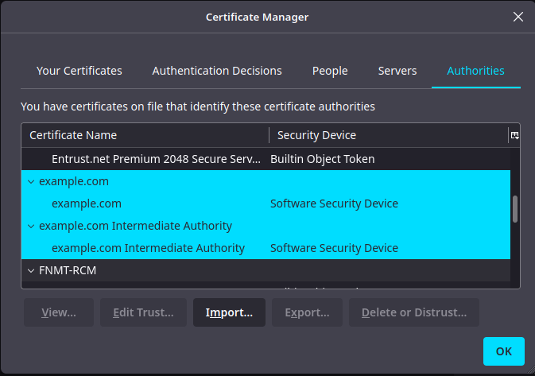
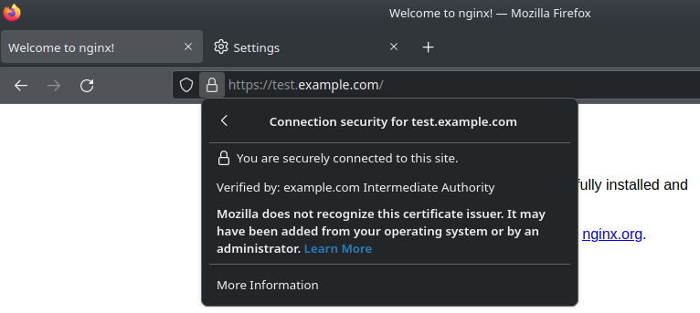
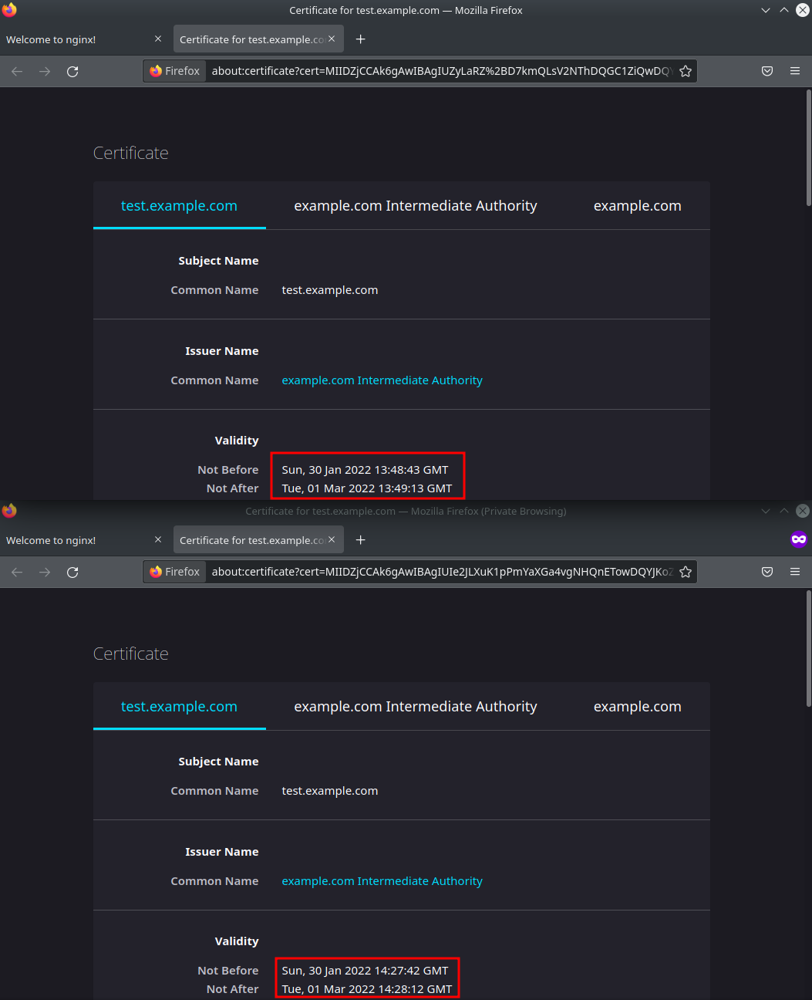

# Курсовая работа по итогам модуля "DevOps и системное администрирование"

Курсовая работа необходима для проверки практических навыков, полученных в ходе прохождения курса "DevOps и системное администрирование".

Мы создадим и настроим виртуальное рабочее место. Позже вы сможете использовать эту систему для выполнения домашних заданий по курсу

## Задание

---

<details>
<summary>Выполение курсовой с помощью vagrant и  скрипта развертывания</summary>

Файлы:
- [Vagrantfile](kurs_1/Vagrantfile)  
- [bootstrap.sh](kurs_1/bootstrap.sh)  
- [regen.sh](kurs_1/regen.sh)  

```bash
mkdir kurs_1
cd kurs_1
wget https://raw.githubusercontent.com/badanin/netology/master/4.4_Курсовая_DevOps_и_системное_администрирование/kurs_1/Vagrantfile
wget https://raw.githubusercontent.com/badanin/netology/master/4.4_Курсовая_DevOps_и_системное_администрирование/kurs_1/bootstrap.sh
wget https://raw.githubusercontent.com/badanin/netology/master/4.4_Курсовая_DevOps_и_системное_администрирование/kurs_1/regen.sh

vagrant up
```

Корневой сертификат `CA_cert.crt` будет лежать в этой же директории.

</details>

---

**1. Создайте виртуальную машину Linux.**

Создаем виртуальную машину с помощью `vagrant`

```bash
mkdir kurs_1
cd kurs_1
echo 'Vagrant.configure("2") do |config|
  config.vm.box = "bento/ubuntu-20.04"
  config.vm.network "public_network"
  config.vm.provider "virtualbox" do |v|
    v.name = "kurs_1"
  end
end
' > Vagrantfile
vagrant up
vagrant ssh
```

**2. Установите ufw и разрешите к этой машине сессии на порты 22 и 443, при этом трафик на интерфейсе localhost (lo) должен ходить свободно на все порты.**

Устанавливаем и настраиваем `ufw`

```bash
sudo apt update
sudo apt install ufw

sudo ufw default deny incoming
sudo ufw default allow outgoing
sudo ufw allow http
sudo ufw allow https
sudo ufw allow from 127.0.0.0/8
sudo ufw allow from 10.0.2.0/24
sudo ufw enable 
```

**3. Установите hashicorp vault ([инструкция по ссылке](https://learn.hashicorp.com/tutorials/vault/getting-started-install?in=vault/getting-started#install-vault)).**

Устанавливаем `vault`

```bash
curl -fsSL https://apt.releases.hashicorp.com/gpg | sudo apt-key add -
sudo apt-add-repository "deb [arch=amd64] https://apt.releases.hashicorp.com $(lsb_release -cs) main"
sudo apt-get update && sudo apt-get install -y vault jq
sudo vault -autocomplete-install
```

**4. Cоздайте центр сертификации по инструкции ([ссылка](https://learn.hashicorp.com/tutorials/vault/pki-engine?in=vault/secrets-management)) и выпустите сертификат для использования его в настройке веб-сервера nginx (срок жизни сертификата - месяц).**

Инициализация `vault`

```bash
sed -e '/#listener/,+4 s/#//' /etc/vault.d/vault.hcl | sed -e '/# HTTPS/,+5 s/^/#/' | sudo tee /etc/vault.d/vault.hcl

sudo systemctl enable vault.service
sudo systemctl start vault.service

export VAULT_ADDR=http://127.0.0.1:8200
mkdir /etc/certs
vault operator init -n 1 -t 1 | sudo tee /etc/vault.d/init.file

cat /etc/vault.d/init.file | grep "Unseal Key 1: " | sed 's/Unseal Key 1: //' | sudo tee /etc/vault.d/unseal1.key
cat /etc/vault.d/init.file | grep "Initial Root Token: " | sed 's/Initial Root Token: //' | sudo tee /etc/vault.d/initial.token

vault operator unseal $(cat /etc/vault.d/unseal1.key)
vault login $(cat /etc/vault.d/uinitial.token)
```

Генерация корневого CA

```bash
vault secrets enable pki
vault secrets tune -max-lease-ttl=87600h pki
vault write -field=certificate pki/root/generate/internal common_name="example.com" ttl=87600h | tee /vagrant/CA_cert.crt /etc/certs/CA_cert.crt
vault write pki/config/urls issuing_certificates="$VAULT_ADDR/v1/pki/ca" crl_distribution_points="$VAULT_ADDR/v1/pki/crl"
```
Генерация промежуточного CA

```bash
vault secrets enable -path=pki_int pki
vault secrets tune -max-lease-ttl=43800h pki_int
vault write -format=json pki_int/intermediate/generate/internal common_name="example.com Intermediate Authority" | jq -r '.data.csr' > pki_intermediate.csr
vault write -format=json pki/root/sign-intermediate csr=@pki_intermediate.csr format=pem_bundle ttl="43800h" | jq -r '.data.certificate' > intermediate.cert.pem
vault write pki_int/intermediate/set-signed certificate=@intermediate.cert.pem
```

Генерация сертификатов домена

```bash
vault write pki_int/roles/example-dot-com allowed_domains="example.com" allow_subdomains=true max_ttl="720h"
vault write -format=json pki_int/issue/example-dot-com common_name="test.example.com" ttl="720h" > test.example.com.crt

cat test.example.com.crt | jq -r .data.certificate | sudo tee /etc/certs/test.example.com.crt.pem
cat test.example.com.crt | jq -r .data.issuing_ca | sudo tee -a /etc/certs/test.example.com.crt.pem
cat test.example.com.crt | jq -r .data.private_key | sudo tee /etc/certs/test.example.com.crt.key
```


**5. Установите корневой сертификат созданного центра сертификации в доверенные в хостовой системе.**



**6. Установите nginx.**

```bash
sudo apt install -y nginx
```

**7. По инструкции ([ссылка](https://nginx.org/en/docs/http/configuring_https_servers.html)) настройте nginx на https, используя ранее подготовленный сертификат:**
  - можно использовать стандартную стартовую страницу nginx для демонстрации работы сервера;
  - можно использовать и другой html файл, сделанный вами;

```bash
echo 'server {
        listen                  443 ssl;
        server_name             test.example.com;
        ssl_certificate         /etc/certs/test.example.com.crt.pem;
        ssl_certificate_key     /etc/certs/test.example.com.crt.key;
        ssl_protocols           TLSv1 TLSv1.1 TLSv1.2;
        ssl_ciphers             HIGH:!aNULL:!MD5;
}' | sudo tee /etc/nginx/sites-enabled/test.example.com

sudo systemctl restart nginx.service
```

**8. Откройте в браузере на хосте https адрес страницы, которую обслуживает сервер nginx.**



**9. Создайте скрипт, который будет генерировать новый сертификат в vault:**
  - генерируем новый сертификат так, чтобы не переписывать конфиг nginx;
  - перезапускаем nginx для применения нового сертификата.

```bash
echo '#!/usr/bin/env bash
export VAULT_ADDR=http://127.0.0.1:8200

vault operator unseal $(cat /etc/vault.d/unseal1.key)
vault login $(cat /etc/vault.d/initial.token)

vault write pki_int/roles/example-dot-com allowed_domains="example.com" allow_subdomains=true max_ttl="720h"
vault write -format=json pki_int/issue/example-dot-com common_name="test.example.com" ttl="720h" > test.example.com.crt

cat test.example.com.crt | jq -r .data.certificate | sudo tee /etc/certs/test.example.com.crt.pem
cat test.example.com.crt | jq -r .data.issuing_ca | sudo tee -a /etc/certs/test.example.com.crt.pem
cat test.example.com.crt | jq -r .data.private_key | sudo tee /etc/certs/test.example.com.crt.key

systemctl restart nginx.service' | sudo tee /etc/vault.d/regen.sh

sudo chmod +x tee /etc/vault.d/regen.sh
```


**10. Поместите скрипт в crontab, чтобы сертификат обновлялся какого-то числа каждого месяца в удобное для вас время.**

```bash
echo '0 0 1 * * root /etc/vault.d/regen.sh' | sudo tee -a /etc/crontab
```

