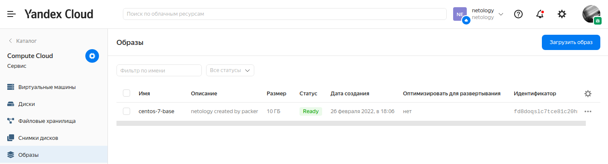
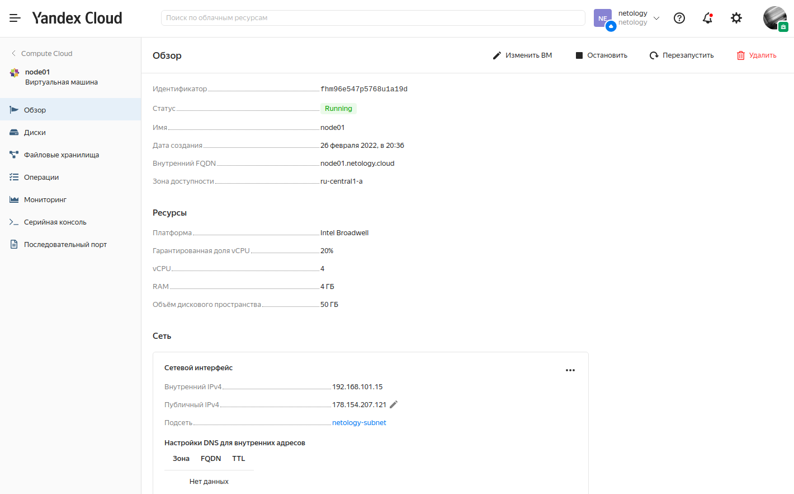
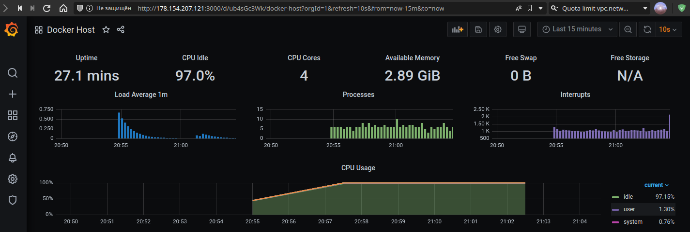

# Домашнее задание к занятию "5.4. Оркестрация группой Docker контейнеров на примере Docker Compose"

## Задача 1

Создать собственный образ операционной системы с помощью Packer.

Для получения зачета, вам необходимо предоставить:
- Скриншот страницы, как на слайде из презентации (слайд 37).

```bash
sudo apt install packer
curl https://storage.yandexcloud.net/yandexcloud-yc/install.sh | bash
```

```bash
yc init 
```

> Welcome! This command will take you through the configuration process.  
> Pick desired action:  
>  [1] Re-initialize this profile 'default' with new settings   
>  [2] Create a new profile  
> Please enter your numeric choice: 2  
> Enter profile name. Names start with a lower case letter and contain only lower case letters a-z, digits 0-9, and hyphens '-': netology  
> Please go to https://oauth.yandex.ru/authorize?response_type=token&client_id=1a6990aa636648e9b2ef855fa7bec2fb in order to obtain OAuth token.  
>   
> Please enter OAuth token: **TOKEN**  
> You have one cloud available: 'netology' (id = b1gl3q4mppo2hr050209). It is going to be used by default.  
> Please choose folder to use:  
>  [1] netology (id = b1gdd0aubdchnul7a8ce)  
>  [2] Create a new folder  
> Please enter your numeric choice: 1  
> Your current folder has been set to 'netology' (id = b1gdd0aubdchnul7a8ce).  
> Do you want to configure a default Compute zone? [Y/n] y  
> Which zone do you want to use as a profile default?  
>  [1] ru-central1-a  
>  [2] ru-central1-b  
>  [3] ru-central1-c  
>  [4] Don't set default zone  
> Please enter your numeric choice: 1  
> Your profile default Compute zone has been set to 'ru-central1-a'.  

```bash
yc config list
```

> token: **TOKEN**  
> cloud-id: b1gvsjqboq66sq651kca  
> folder-id: b1g496n53g14odk9fhcs  
> compute-default-zone: ru-central1-a  

```bash
yc vpc network create --name netology-net
```

> id: enpcmce0id7fin3vbuim  
> folder_id: b1gdd0aubdchnul7a8ce  
> created_at: "2022-02-26T12:42:25Z"  
> name: netology-net  

```bash
yc vpc subnet create --name netology-subnet --zone ru-central1-a --range 10.0.0.0/24 --network-name netology-net --description "netology 5.4"
```

> id: e9bl7gbrhahlah8ui0i5  
> folder_id: b1gdd0aubdchnul7a8ce  
> created_at: "2022-02-26T12:53:11Z"  
> name: netology-subnet  
> description: netology 5.4  
> network_id: enpcmce0id7fin3vbuim  
> zone_id: ru-central1-a  
> v4_cidr_blocks:  
> - 10.0.0.0/24  

```json
{
  "builders": [
    {
      "type": "yandex",
      "token": "TOKEN",
      "folder_id": "b1gdd0aubdchnul7a8ce",
      "zone": "ru-central1-a",

      "image_name": "centos-7-base",
      "image_family": "centos",
      "image_description": "netology created by packer",

      "source_image_family": "centos-7",
      "subnet_id": "e9blvbfib48empo0af9u",
      "use_ipv4_nat": true,
      "disk_type": "network-ssd",
      "ssh_username": "centos"
    }
  ],
  "provisioners": [
    {
      "inline": [
        "sudo yum -y update",
        "sudo yum -y install bridge-utils bind-utils iptables curl net-tools tcpdump rsync telnet openssh-server wget",
        "sudo wget https://github.com/bcicen/ctop/releases/download/0.7.6/ctop-0.7.6-linux-amd64 -O /usr/local/bin    /ctop",
        "sudo chmod +x /usr/local/bin/ctop"
      ],
      "type": "shell"
    }
  ]
}
```

```bash
packer validate centos-7-base.json
```

> The configuration is valid.  

```bash
packer build centos-7-base.json
```

> packer build centos-7-base.json   
> yandex: output will be in this color.  
>   
> ==> yandex: Creating temporary RSA SSH key for instance...  
> ==> yandex: Using as source image: fd8jpf08c7koo4cp33rk (name: "centos-7-v20220221", family: "centos-7")  
> ==> yandex: Use provided subnet id e9blvbfib48empo0af9u  
> ==> yandex: Creating disk...  
> ==> yandex: Creating instance...  
> ==> yandex: Waiting for instance with id fhmc5p3u9b087pv8msr6 to become active...  
>     yandex: Detected instance IP: 62.84.118.102  
> ==> yandex: Using SSH communicator to connect: 62.84.118.102  
> ==> yandex: Waiting for SSH to become available...  
> ==> yandex: Connected to SSH!  
> ==> yandex: Provisioning with shell script: /tmp/packer-shell413935406  
> ...  
>     yandex: Complete!  
> ==> yandex: Stopping instance...  
> ==> yandex: Deleting instance...  
>     yandex: Instance has been deleted!  
> ==> yandex: Creating image: centos-7-base  
> ==> yandex: Waiting for image to complete...  
> ==> yandex: Success image create...  
> ==> yandex: Destroying boot disk...  
>     yandex: Disk has been deleted!  
> Build 'yandex' finished after 3 minutes 57 seconds.  
>   
> ==> Wait completed after 3 minutes 57 seconds  
>   
> ==> Builds finished. The artifacts of successful builds are:  
> --> yandex: A disk image was created: centos-7-base (id: fd8doqslc7tce81c20hn) with family name centos  

```bash
yc compute image list
```

> +----------------------+---------------+--------+----------------------+--------+  
> |          ID          |     NAME      | FAMILY |     PRODUCT IDS      | STATUS |  
> +----------------------+---------------+--------+----------------------+--------+  
> | fd8doqslc7tce81c20hn | centos-7-base | centos | f2e51ukmtk6gbvmufitj | READY  |  
> +----------------------+---------------+--------+----------------------+--------+  

---




## Задача 2

Создать вашу первую виртуальную машину в Яндекс.Облаке.

Для получения зачета, вам необходимо предоставить:
- Скриншот страницы свойств созданной ВМ, как на примере ниже:

```bash
sudo apt install terraform
```

```bash
terraform init
```

> Initializing the backend...  
>   
> Initializing provider plugins...  
> - Reusing previous version of yandex-cloud/yandex from the dependency lock file  
> - Using previously-installed yandex-cloud/yandex v0.71.0  
>   
> Terraform has been successfully initialized!  
>   
> You may now begin working with Terraform. Try running "terraform plan" to see  
> any changes that are required for your infrastructure. All Terraform commands  
> should now work.  
>   
> If you ever set or change modules or backend configuration for Terraform,  
> rerun this command to reinitialize your working directory. If you forget, other  
> commands will detect it and remind you to do so if necessary.  

```bash
terraform apply
```

> Terraform used the selected providers to generate the following execution plan. Resource actions are indicated with  
> the following symbols:  
>   + create  
>   
> Terraform will perform the following actions:  
>   
> ...  
>   
> Plan: 3 to add, 0 to change, 0 to destroy.  
>   
> Changes to Outputs:  
>   + external_ip_address_node01_yandex_cloud = (known after apply)  
>   + internal_ip_address_node01_yandex_cloud = (known after apply)  
>   
> Do you want to perform these actions?  
>   Terraform will perform the actions described above.  
>   Only 'yes' will be accepted to approve.  
>   
>   Enter a value: yes  
>   
> yandex_vpc_network.default: Creating...  
> yandex_vpc_network.default: Creation complete after 1s [id=enpni6tcblqlh6f02j98]  
> yandex_vpc_subnet.default: Creating...  
> yandex_vpc_subnet.default: Creation complete after 0s [id=e9b56sh608tdjqr6l49k]  
> yandex_compute_instance.node01: Creating...  
> yandex_compute_instance.node01: Still creating... [10s elapsed]  
> yandex_compute_instance.node01: Still creating... [20s elapsed]  
> yandex_compute_instance.node01: Still creating... [30s elapsed]  
> yandex_compute_instance.node01: Still creating... [40s elapsed]  
> yandex_compute_instance.node01: Creation complete after 42s [id=fhmuplgtfqe7f43ton55]  
>   
> Apply complete! Resources: 3 added, 0 changed, 0 destroyed.  
>   
> Outputs:  
>   
> external_ip_address_node01_yandex_cloud = "178.154.207.121"  
> internal_ip_address_node01_yandex_cloud = "192.168.101.15"  

---



## Задача 3

Создать ваш первый готовый к боевой эксплуатации компонент мониторинга, состоящий из стека микросервисов.

Для получения зачета, вам необходимо предоставить:
- Скриншот работающего веб-интерфейса Grafana с текущими метриками, как на примере ниже

```bash
ansible-playbook provision.yml 
```

> PLAY [nodes] ***********************************************************************************************  
>   
> TASK [Gathering Facts] *************************************************************************************  
> ok: [node01.netology.cloud]  
>   
> ...  
>   
> PLAY RECAP *************************************************************************************************  
> node01.netology.cloud      : ok=12   changed=5    unreachable=0    failed=0    skipped=0    rescued=0    ignored=0     



