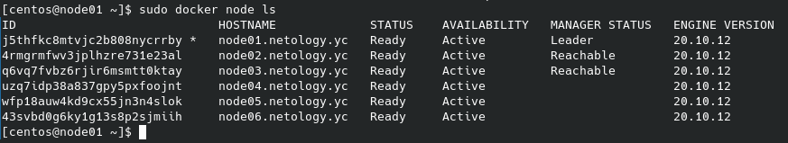
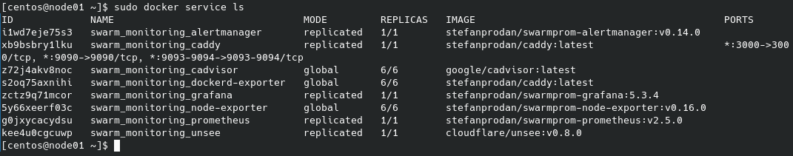
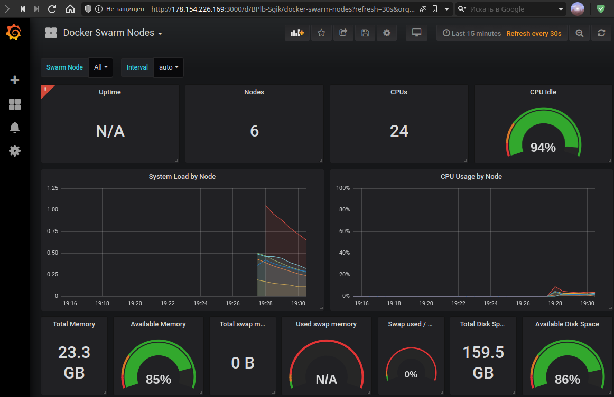

# Домашнее задание к занятию "5.5. Оркестрация кластером Docker контейнеров на примере Docker Swarm"

---

## Задача 1

Дайте письменые ответы на следующие вопросы:

- В чём отличие режимов работы сервисов в Docker Swarm кластере: replication и global?

При **replication** задется точное количетсво копий сервисов, при **global** сервис разварачивается на всех доступных нодах.

- Какой алгоритм выбора лидера используется в Docker Swarm кластере?

**Raft**

- Что такое Overlay Network?

Распределенная сеть между несколькими хостами Docker, позволяет объединять рабочие контейнеры расположенные на различных нодах, обеспечиваю безопасность передачи данных по ней.

## Задача 2

Создать ваш первый Docker Swarm кластер в Яндекс.Облаке

Для получения зачета, вам необходимо предоставить скриншот из терминала (консоли), с выводом команды:

```bash
docker node ls
```


## Задача 3

Создать ваш первый, готовый к боевой эксплуатации кластер мониторинга, состоящий из стека микросервисов.

Для получения зачета, вам необходимо предоставить скриншот из терминала (консоли), с выводом команды:
```
docker service ls
```



---



