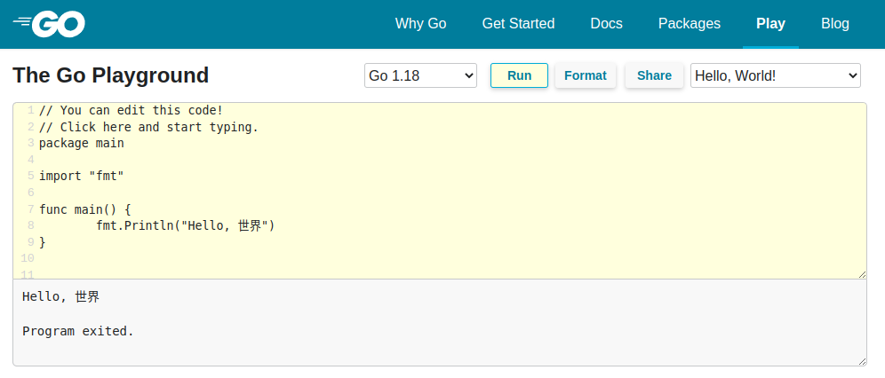
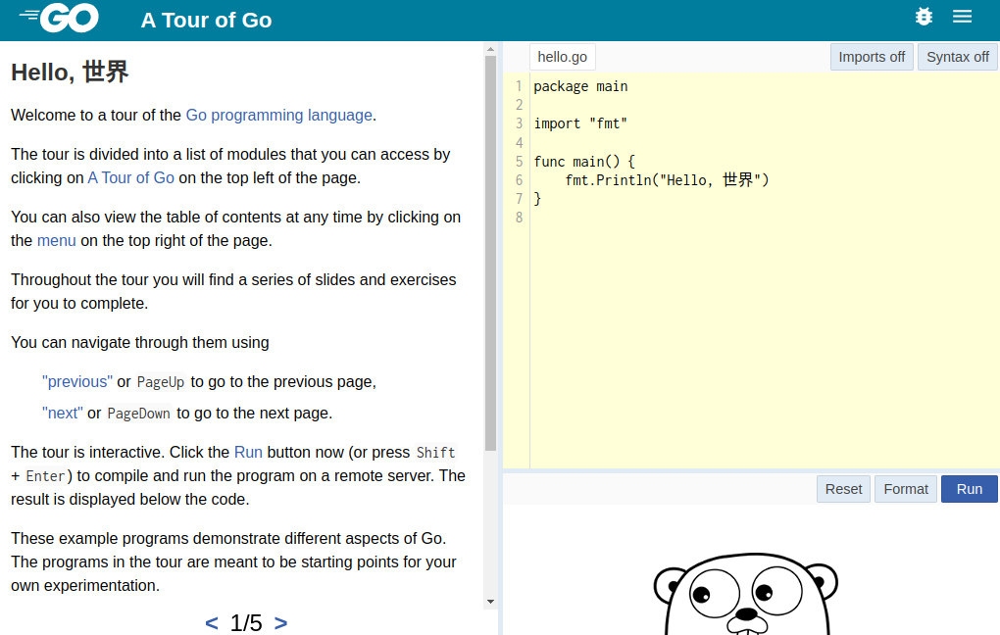

# Домашнее задание к занятию "7.5. Основы golang"

*С `golang` в рамках курса, мы будем работать не много, поэтому можно использовать любой IDE. Но рекомендуем ознакомиться с [GoLand](https://www.jetbrains.com/ru-ru/go/).*  

## Задача 1. Установите golang.
1. *Воспользуйтесь инструкций с официального сайта: [https://golang.org/](https://golang.org/).*

```bash
sudo tar -C /usr/local -xzf go1.18.3.linux-amd64.tar.gz
echo 'export PATH=$PATH:/usr/local/go/bin' | sudo tee -a /etc/profile
go version 
```

```text
go version go1.18.3 linux/amd64
```

2. *Так же для тестирования кода можно использовать песочницу: [https://play.golang.org/](https://play.golang.org/).*



## Задача 2. Знакомство с gotour.
*У Golang есть обучающая интерактивная консоль [https://tour.golang.org/](https://tour.golang.org/). Рекомендуется изучить максимальное количество примеров. В консоли уже написан необходимый код, осталось только с ним ознакомиться и поэкспериментировать как написано в инструкции в левой части экрана.*  



## Задача 3. Написание кода. 
*Цель этого задания закрепить знания о базовом синтаксисе языка. Можно использовать редактор кода на своем компьютере, либо использовать песочницу: [https://play.golang.org/](https://play.golang.org/).*

1. *Напишите программу для перевода метров в футы (1 фут = 0.3048 метр). Можно запросить исходные данные у пользователя, а можно статически задать в коде. Для взаимодействия с пользователем можно использовать функцию `Scanf`:*

```go
package main

import "fmt"

func main() {
    fmt.Print("Enter meters: ")
    var input float64
    fmt.Scanf("%f", &input)
    output := input / 0.3048
    fmt.Println(output)
}
```

[main.go](src/7.5.1/main.go)

```bash
go run main.go
```

```text
Enter meters: 1
3.280839895013123
```

2. *Напишите программу, которая найдет наименьший элемент в любом заданном списке, например:*

```
x := []int{48,96,86,68,57,82,63,70,37,34,83,27,19,97,9,17,}
```

```go
package main

import "fmt"
import "sort"

func main() {
    x := []int{48, 96, 86, 68, 57, 82, 63, 70, 37, 34, 83, 27, 19, 97, 9, 17}
    sort.Ints(x)
    fmt.Println(x[0])
}
```

[main.go](src/7.5.2/main.go)

```bash
go run main.go
```

```text
9
```
    
3. *Напишите программу, которая выводит числа от 1 до 100, которые делятся на 3. То есть `(3, 6, 9, …)`.*

```go
package main

import "fmt"

func main() {
    var x []int
    for y := 3; y <= 100; y = y + 3 {
        x = append(x, y)
    }
    fmt.Println(x)
}
```

[main.go](src/7.5.3/main.go)

```bash
go run main.go
```

```text
[3 6 9 12 15 18 21 24 27 30 33 36 39 42 45 48 51 54 57 60 63 66 69 72 75 78 81 84 87 90 93 96 99]
```

*В виде решения ссылку на код или сам код.*

## Задача 4. Протестировать код (не обязательно).

*Создайте тесты для функций из предыдущего задания.*
