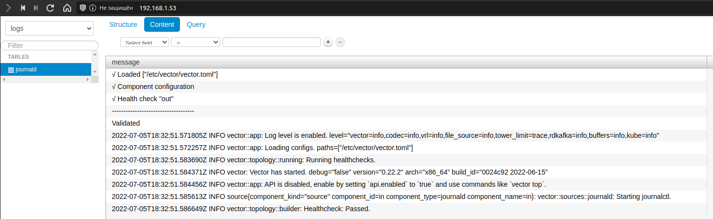

# Домашнее задание к занятию "8.4 Работа с Roles"

*Наша основная цель - разбить наш playbook на отдельные roles. Задача: сделать roles для clickhouse, vector и lighthouse и написать playbook для использования этих ролей. Ожидаемый результат: существуют три ваших репозитория: два с roles и один с playbook.*

1. *Создать в старой версии playbook файл `requirements.yml` и заполнить его следующим содержимым:*

```yaml
---
  - src: git@github.com:AlexeySetevoi/ansible-clickhouse.git
    scm: git
    version: "1.11.0"
    name: clickhouse
```

2. *При помощи `ansible-galaxy` скачать себе эту роль.*

```bash
ansible-galaxy role install --role-file requirenments.yml
```

```text
Starting galaxy role install process
- extracting clickhouse to /home/a/.ansible/roles/clickhouse
- clickhouse (1.11.0) was installed successfully
```

3. *Создать новый каталог с ролью при помощи `ansible-galaxy role init vector-role`.*

```
- Role vector-role was created successfully
```

4. *На основе tasks из старого playbook заполните новую role. Разнесите переменные между `vars` и `default`.*
5. *Перенести нужные шаблоны конфигов в `templates`.*
6. *Описать в `README.md` обе роли и их параметры.*
7. *Повторите шаги 3-6 для lighthouse. Помните, что одна роль должна настраивать один продукт.*
8. *Выложите все roles в репозитории. Проставьте тэги, используя семантическую нумерацию Добавьте roles в `requirements.yml` в playbook.*
9. *Переработайте playbook на использование roles. Не забудьте про зависимости lighthouse и возможности совмещения `roles` с `tasks`.*
10. *Выложите playbook в репозиторий.*

```bash
ansible-galaxy role install --role-file requirenments.yml
```

  ```text
  Starting galaxy role install process
  - extracting vector to /home/a/.ansible/roles/vector
  - vector (0.0.1) was installed successfully
  - extracting clickhouse to /home/a/.ansible/roles/clickhouse
  - clickhouse (0.0.1) was installed successfully
  - extracting lighthouse to /home/a/.ansible/roles/lighthouse
  - lighthouse (0.0.1) was installed successfully
  ```

---

```bash
ansible-playbook -i inventory/prod.yml site.yml
```

  ```text
  PLAY [Install Clickhouse Vector Lighthouse] ************************************************************************

  TASK [Gathering Facts] *********************************************************************************************
  ok: [clickhouse-01]

  TASK [clickhouse : Get clickhouse distrib] *************************************************************************
  changed: [clickhouse-01] => (item=clickhouse-client)
  changed: [clickhouse-01] => (item=clickhouse-server)
  failed: [clickhouse-01] (item=clickhouse-common-static) => {"ansible_loop_var": "item", "changed": false, "dest": "/tmp/clickhouse-common-static_22.6.2.12.deb", "elapsed": 0, "item": "clickhouse-common-static", "msg": "Request failed", "response": "HTTP Error 404: Not Found", "status_code": 404, "url": "https://packages.clickhouse.com/deb/pool/stable/clickhouse-common-static_22.6.2.12_all.deb"}

  TASK [clickhouse : Get clickhouse distrib static] ******************************************************************
  changed: [clickhouse-01]

  TASK [clickhouse : Install clickhouse clickhouse-common-static] ****************************************************
  changed: [clickhouse-01]

  TASK [clickhouse : Install clickhouse clickhouse-client] ***********************************************************
  changed: [clickhouse-01]

  TASK [clickhouse : Install clickhouse clickhouse-server] ***********************************************************
  changed: [clickhouse-01]

  TASK [clickhouse : Start clickhouse service] ***********************************************************************
  changed: [clickhouse-01]

  TASK [clickhouse : Sleep for 10 seconds and continue with play] ****************************************************
  ok: [clickhouse-01]

  TASK [clickhouse : Create database] ********************************************************************************
  changed: [clickhouse-01]

  TASK [clickhouse : Create table] ***********************************************************************************
  changed: [clickhouse-01]

  TASK [vector : Get vector distrib] *********************************************************************************
  changed: [clickhouse-01]

  TASK [vector : mkdir for vector] ***********************************************************************************
  changed: [clickhouse-01]

  TASK [vector : Extract vector archive] *****************************************************************************
  changed: [clickhouse-01]

  TASK [vector : Create vector bin link] *****************************************************************************
  changed: [clickhouse-01]

  TASK [vector : Create vector user] *********************************************************************************
  changed: [clickhouse-01]

  TASK [vector : Create vector service link] *************************************************************************
  changed: [clickhouse-01]

  TASK [vector : Create vector var folder] ***************************************************************************
  changed: [clickhouse-01]

  TASK [vector : Create vector config folder] ************************************************************************
  changed: [clickhouse-01]

  TASK [vector : Create vector config file] **************************************************************************
  changed: [clickhouse-01]

  TASK [lighthouse : Install nginx] **********************************************************************************
  changed: [clickhouse-01]

  TASK [lighthouse : Remove file (delete file)] **********************************************************************
  changed: [clickhouse-01]

  TASK [lighthouse : Clone lighthouse] *******************************************************************************
  changed: [clickhouse-01]

  RUNNING HANDLER [vector : Start vector service] ********************************************************************
  changed: [clickhouse-01]

  RUNNING HANDLER [lighthouse : Restart nginx] ***********************************************************************
  changed: [clickhouse-01]

  PLAY RECAP *********************************************************************************************************
  clickhouse-01              : ok=23   changed=21   unreachable=0    failed=0    skipped=0    rescued=1    ignored=0
  ```



11. *В ответ приведите ссылки на оба репозитория с roles и одну ссылку на репозиторий с playbook.*

[netology-8.4-clickhouse](https://github.com/badanin/netology-8.4-clickhouse)  

[netology-8.4-vector](https://github.com/badanin/netology-8.4-vector)  

[netology-8.4-lighthouse](https://github.com/badanin/netology-8.4-lighthouse)  

[playbook](https://github.com/badanin/netology-8.4)  


